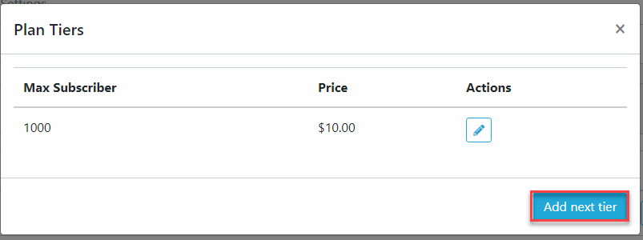

Plans
==============

.. NOTE:: You should setup payment gateway before configurate Plan

==============
Add Plan
==============

- Logging your admin page, click Plans
- Click Add button.
- From Add Plan dialog, fill required information then click OK.

==============
Edit Plan
==============
.. NOTE:: You can't change Price of a plan.

- Logging your admin page, click Plans
- Click the Edit button on the relavant Plan item.
- From Edit Plan dialog, fill required information then click OK.

==============
Plan Pricing
==============

- Logging your admin page, click Plans
- Click the Pricing button on the relavant Plan item.
- From Plan Pricing dialog, click Add Next Tier.
- A new row item will added, enter Subscriber Count and Price, then click Check button to save.

==============
Plan Feature
==============

- Logging your admin page, click Plans
- Click the Features button on the relavant Plan item.
- From Plan Features dialog, click Add button, enter Title and Tooltip then click Save.
- To remove a Feature Item, hover this item then a Delete button will show. Click this button to remove. Then click Save.

==============
Plan Condition
==============

- Logging your admin page, click Plans
- Click the Conditions button on the relavant Plan item.
- From Plan Conditions dialog, check or uncheck the Conversation Card you want to show on this plan.

