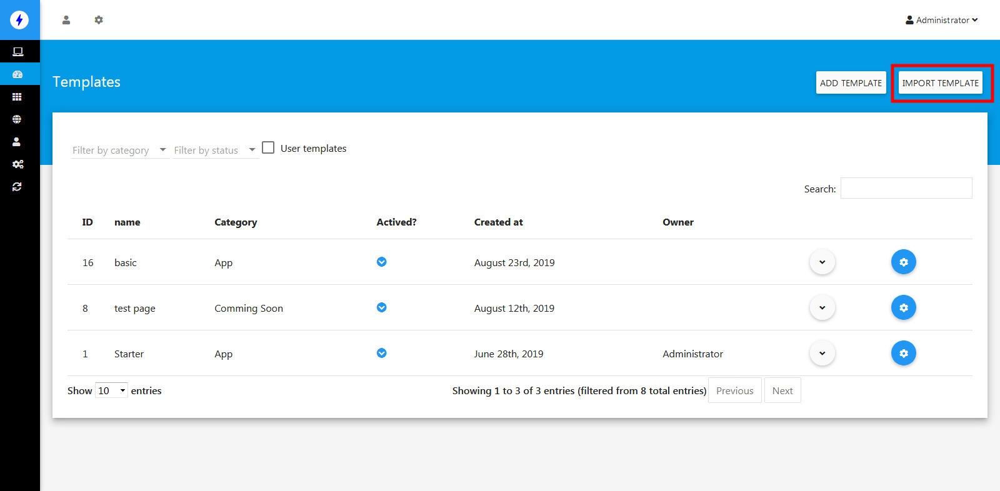

Templates
==============

==============
Adding template
==============

- Logging your admin page, click Templates
- Click Add Template button.
- From Add template page, fill required information then click Save.

==============
Export Template
==============

- From the Template list page, select relevant template and click Export button.
- Select a destination directory if the browser asked for then click OK

==============
Import Template
==============
.. NOTE:: You can't import HTML template, it only works with template exported by this script__

- From the Template list page, click Import button.
- Browse to your exported template then click Open.

