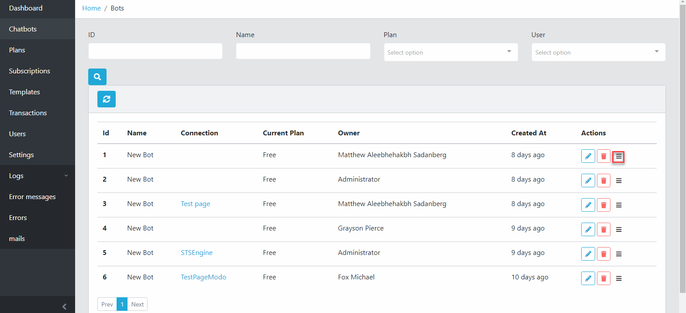
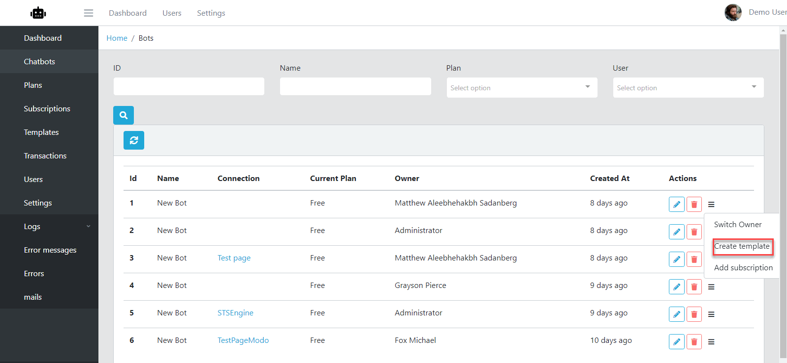
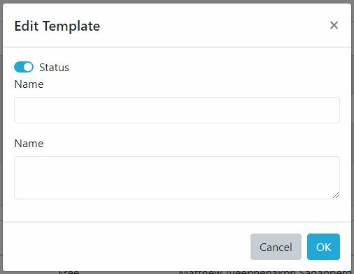

Templates
==============

==============
Add template
==============

- Logging your admin page, click Chatbots
- Click Add Template button.
- From Add template page, fill required information then click Save.

==============
Export Template
==============

- Logging your admin page, click Templates

- From the Template list page, select relevant template and click Export button.
- Select a destination directory if the browser asked for then click OK

.. image:: ../assets/images/exporttemplate.jpg

