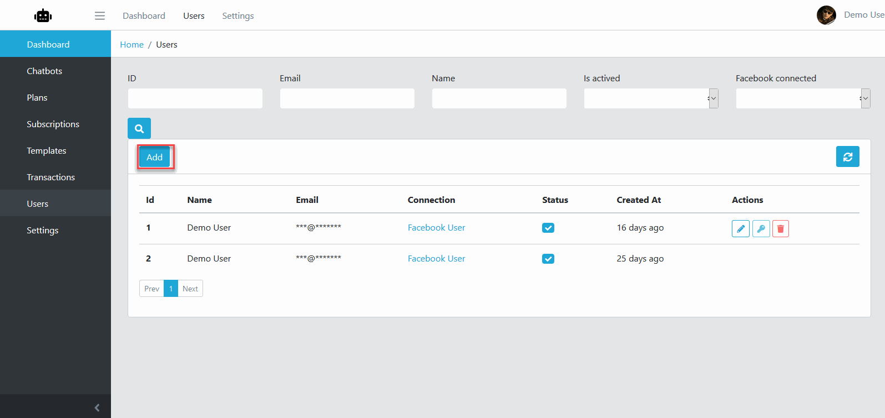
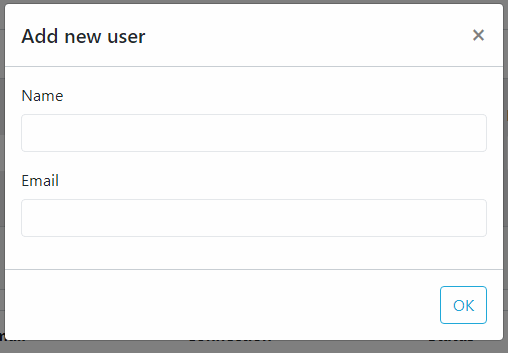
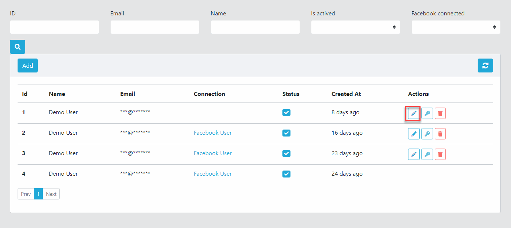
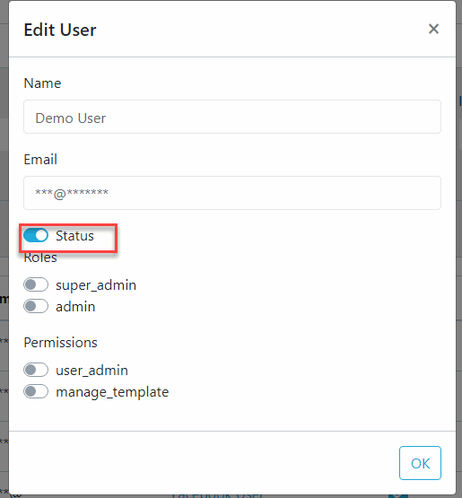

Users
==============

==============
Add User
==============

- Logging your admin page, click Users
- Click Add button.
- From Add User dialog, fill required information then click OK.

==============
Edit User
==============

- Logging your admin page, click Users
- Click the Edit button on the relavant user item.
- From Edit User dialog, fill required information then click OK.

