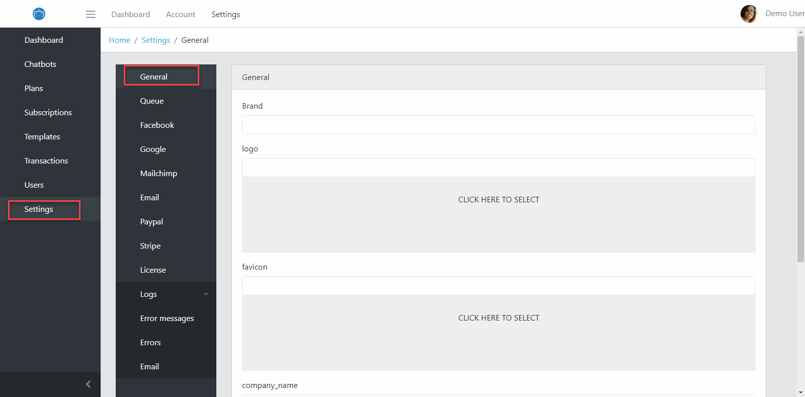

General Settings
==============
| Login to Admin, click Settings, then click General.

Fill the Form with your value then click Save.

- Brand: your Brand Name.
- Logo: Logo image for the top left header of User Page and Admin Page.
- Favicon: setup Favicon Url for the Website.
- Seo Title, Keywords, Description: Setup SEO meta elements for the Website.
