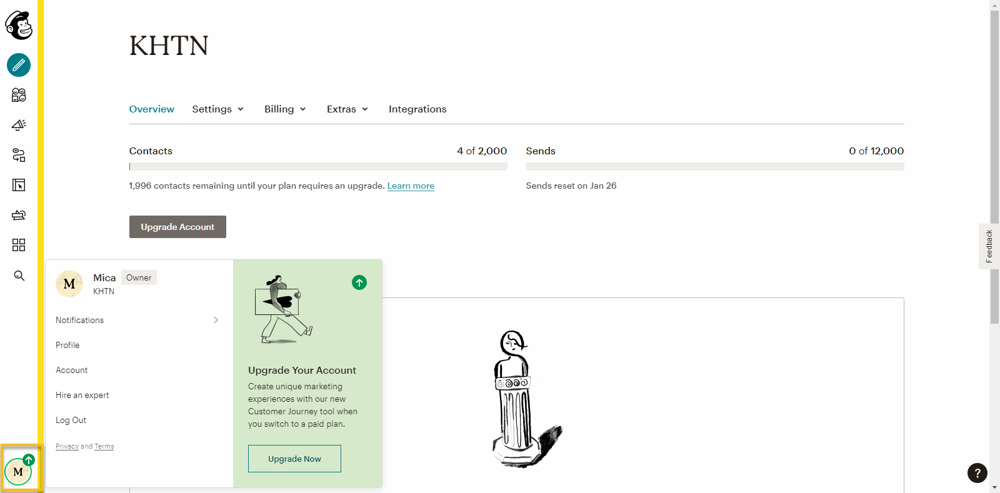
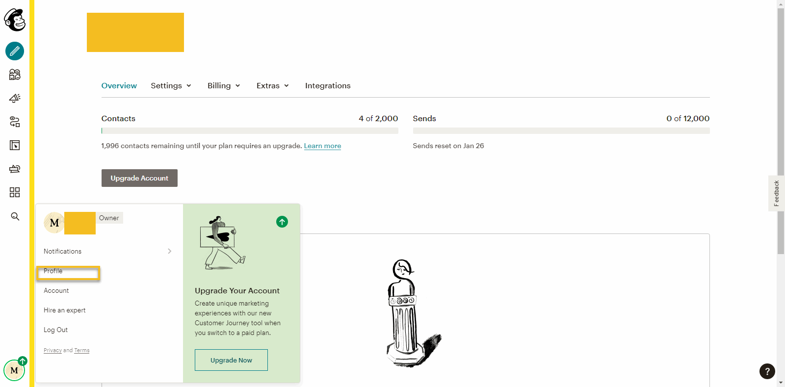
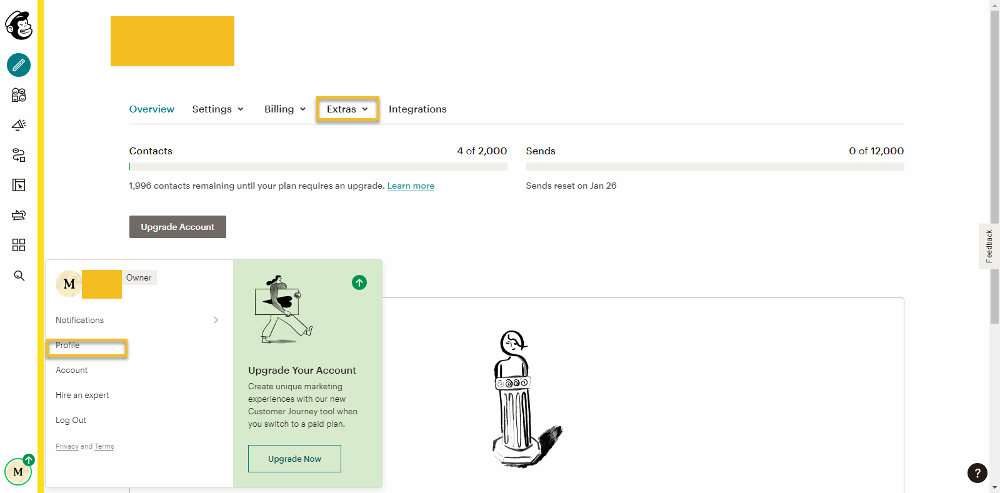
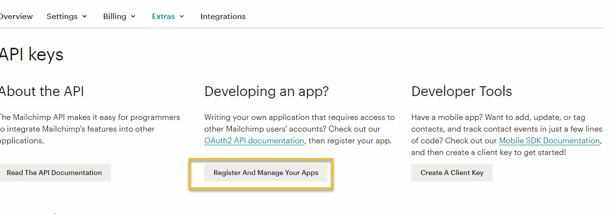
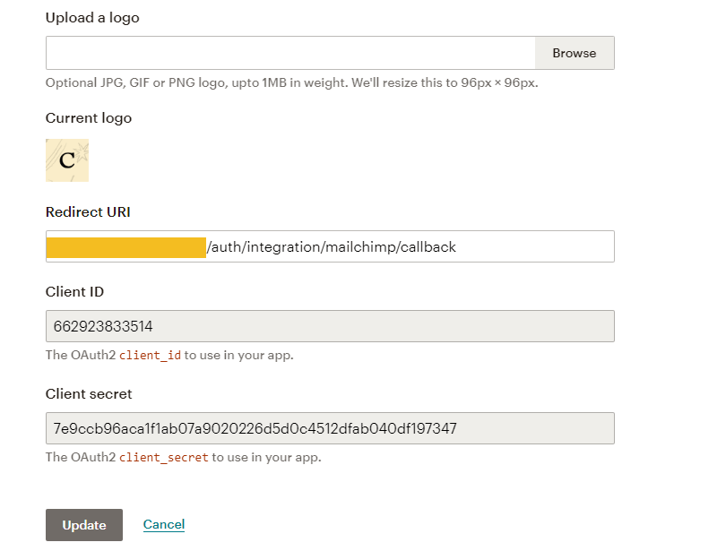

Paypal
==============
- Create an account with https://mailchimp.com
- Login with this account, in the Dashboard screen, click the Account menu located at bottom of the left menu.

- In the Dropdown Account, click Profile.

- In the Account page, click Extras -> API Keys

- Under the “Developing an App?” heading, click Register and Manage Your Apps.

- Click Register an App.
- In the fields provided, input your application’s information and click Create.
- When creation is successful, you’ll see an Application created message appear, and more information at the end of your form, including the Client_ID and Client Secret. Do not share the Client_ID and Client Secret.

- Login to your Admin -> Settings -> Mailchimp tab, fill the Mailchimp form with your Client ID and Client Secret then click Save.

