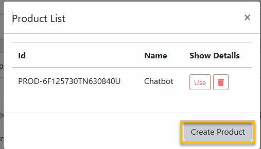

Paypal
==============

==============
Create Paypal Application
==============
1. Go to PayPal’s Developer site at https://developer.paypal.com/  and login with your  PayPal business account email and password.
2. Click on My Apps & Credentials
3. To create a new app, click the Create App button.
4. Add an App Name, select a sandbox account from Sandbox Business Account, and then click on Create App.
5. Get PayPal App Client ID and Secret

==============
Configuration Paypal App
==============

- Login to Admin->Settings->Email, fill this form with your email credentials.
- Fill the Paypal App Client Id and Secret and click Save.

==============
Configuration Paypal Product
==============

- After setting Client Id and Secret, Click Manage Product.
- Click Create Product.
- Click Use on the created product.
- The Product List dialog will close, in the Stripe settings form, Click Save

==============
Configuration Paypal Webhook
==============

- After setting Client Id and Secret, Click Manage Webhook.
- Click Create Webhook.
- Click Use on the created webhook.
- The Webhook List dialog will close, in the Stripe settings form, Click Save

==============
Troubeshotting Paypal
==============

1. Check if Paypal Plan creating.

- Go to Paypal Setting, scroll to bottom of the Page, click Manage.

- Check if the Paypal Id Column of all Plan (exept Free plan) is not empty.

- If there, click Sync for this Plan.

2. Check if Webhook is running.

- Try in the Test mode, upgrade a Bot to any Pro plan.

- If the Payment success, go to PayPal’s Developer site at https://developer.paypal.com/  and login with your  PayPal business account email and password.

- On the left sidebar, click Webhooks Event.

- Next page, select your application in the Filter box

- Check if there is a success webhook event with name Payment Sale Complete in the event list at the time you upgrade your Bot.

- If not, recheck your Paypal Webhook Setting.

