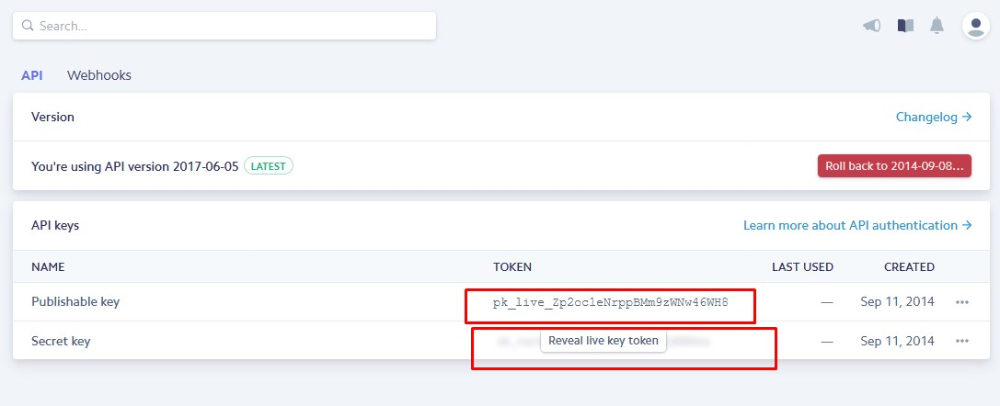
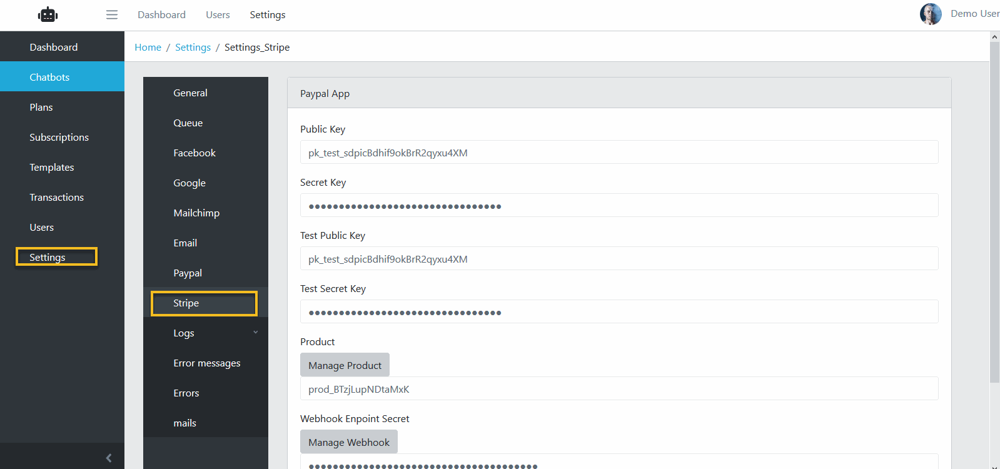
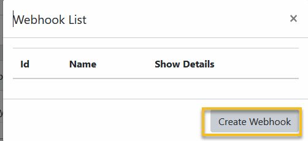
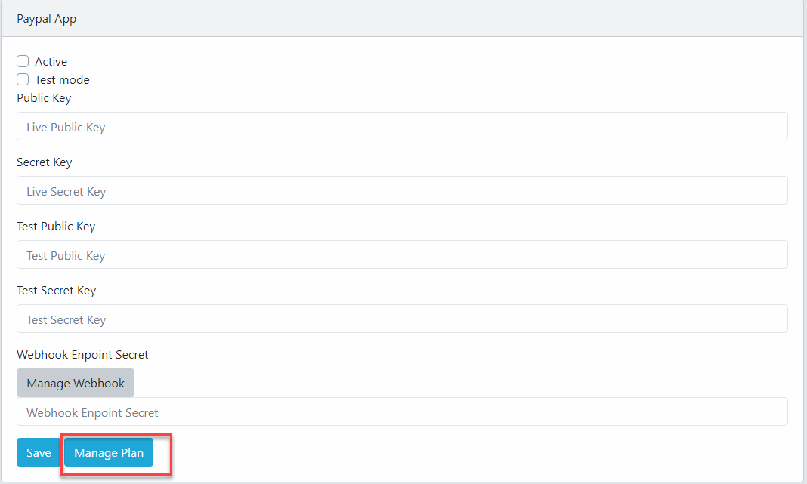
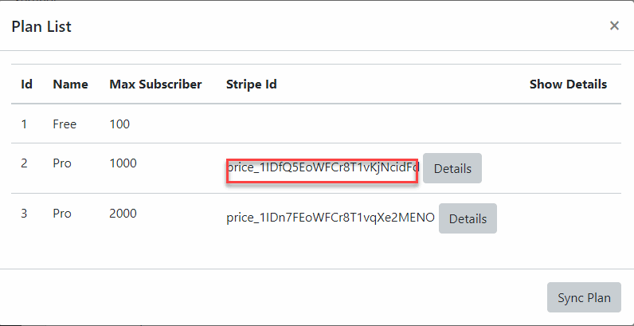
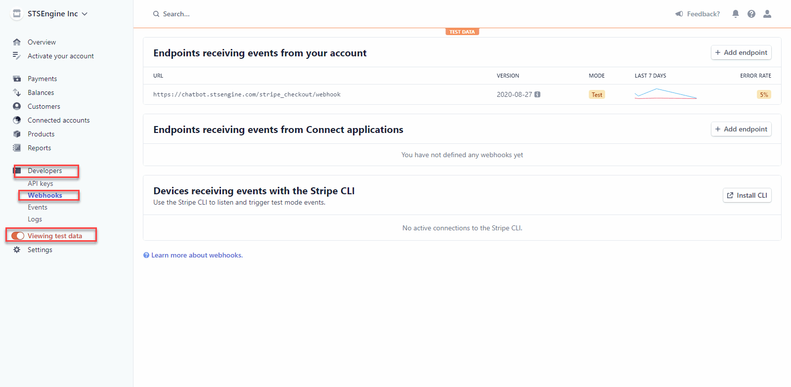
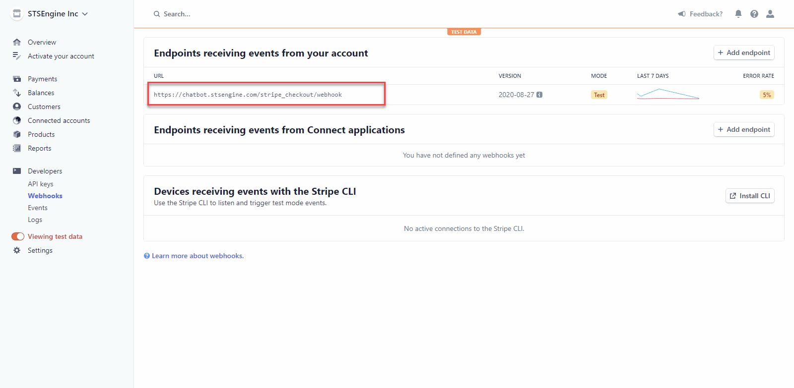
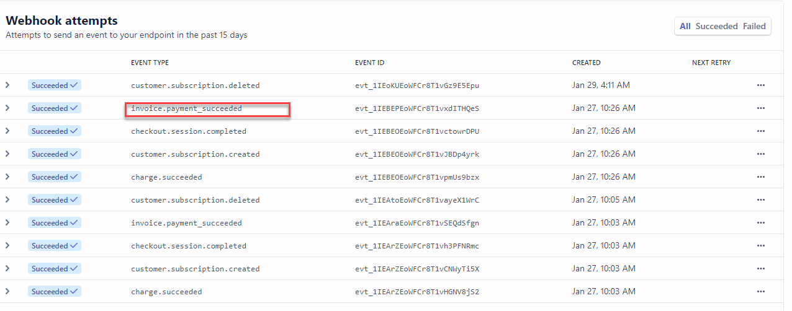

Stripe
==============

==============
Create Stripe Account
==============
- Open this url https://dashboard.stripe.com/register.
- Fill all require field in the Sign Up form then click on Create your Stripe account button.

==============
Getting API Keys
==============

- Open this url https://dashboard.stripe.com/account/apikeys.
- Click Reveal Secret key to get the Secret Key

==============
Configuration Stripe App
==============

- Login to Admin->Settings->Email, fill this form with your email credentials.
- Fill the Stripe Public Key and Secret and click Save.

==============
Configuration Stripe Webhook
==============

- After setting Client Id and Secret, Click Manage Webhook.

- Click Create Webhook.

- The Webhook List dialog will close, in the Stripe settings form, Click Save

==============
Troubeshotting
==============

1. Check if Stripe Plan creating.

- Go to Stripe Setting, scroll to bottom of the Page, click Manage.

- Check if the Stripe Id Column of all Plan (exept Free plan) is not empty.

- If there, click Sync for this Plan.

2. Check if Webhook is running.

- Try in the Test mode, upgrade a Bot to any Pro plan.

- If the Payment success, go to  https://stripe.com/  and login with your Stripe Account.
 
- On the left sidebar, click Developers->Webhook. If your app is in test mode, swith to Test Data.

- Click to the webhook of your site.

- Scroll down to the Webhook Events section.

- Check if there is a success webhook event with name invoice.payment_succeeded in the event list at the time you upgrade your Bot.

- If not, recheck your Paypal Webhook Setting.