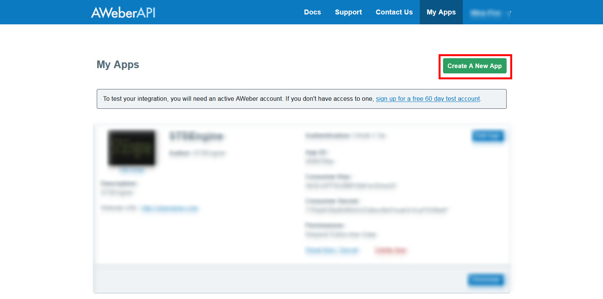
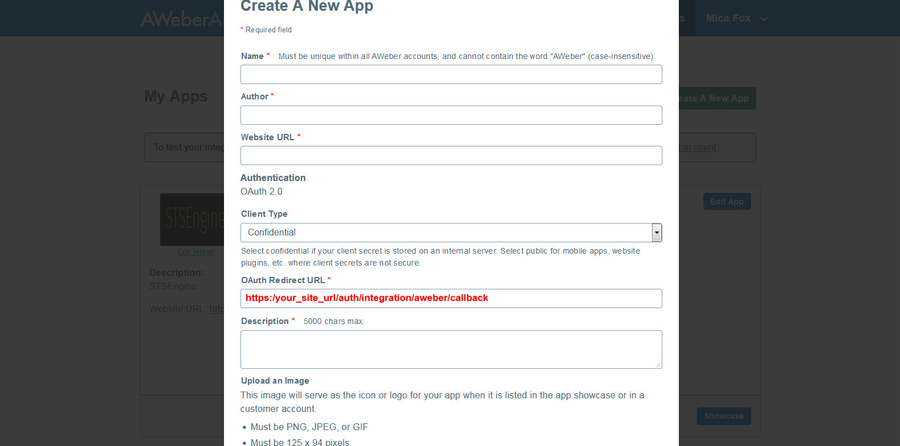
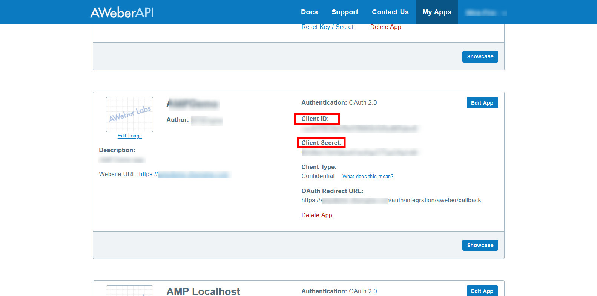

Aweber
==============

- Create an account with https://labs.aweber.com/
- Login with this account, click Create a New app.

- In the Next Popup, fill all required information. Fill OAuth Redirect URL textbox with value https://your_site_url/auth/integration/aweber/callback

- Click Create New App

- On next screen, copy the Client Id and Client Secret, click Edit.

- Open Administration page, navigate to Settings->Integrations. Scroll to the Aweber form and fill required information.

