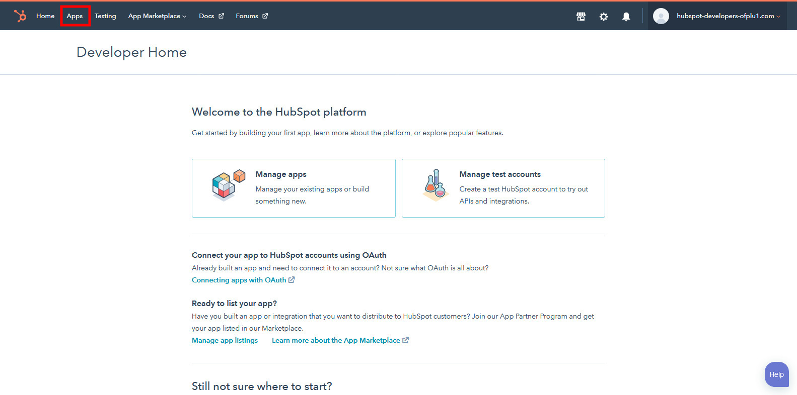
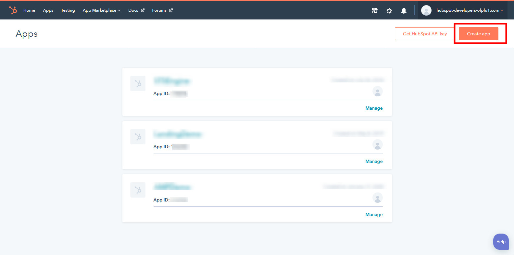
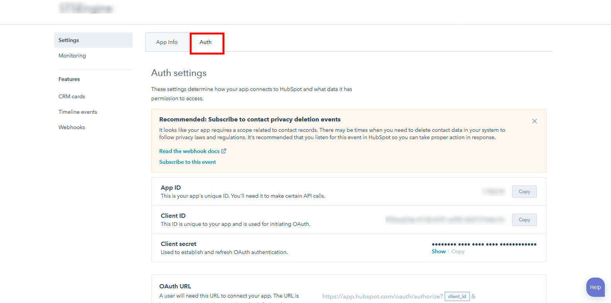
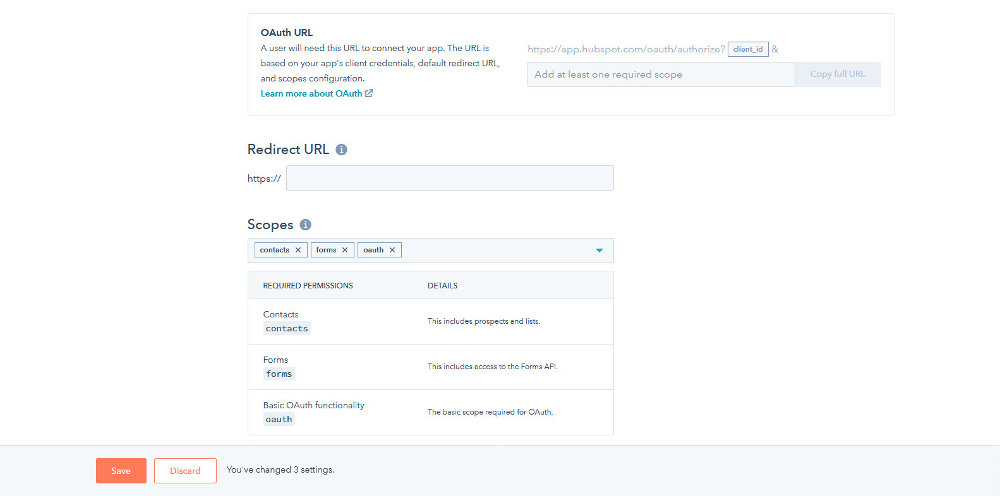
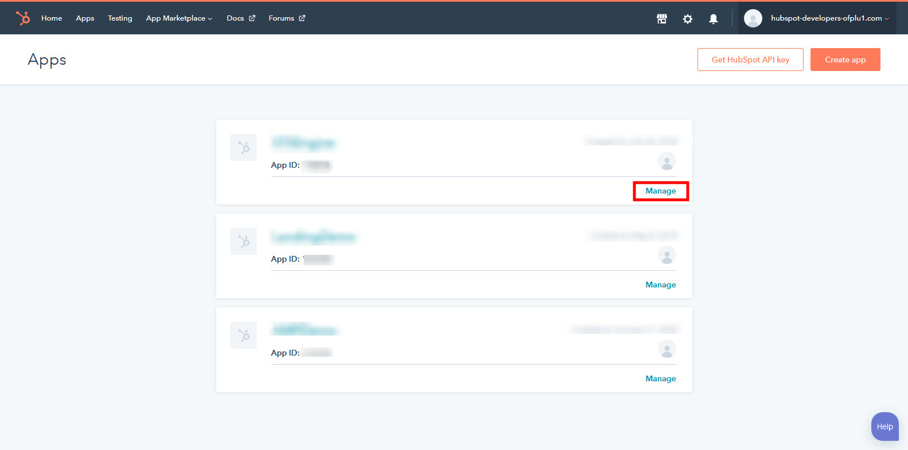
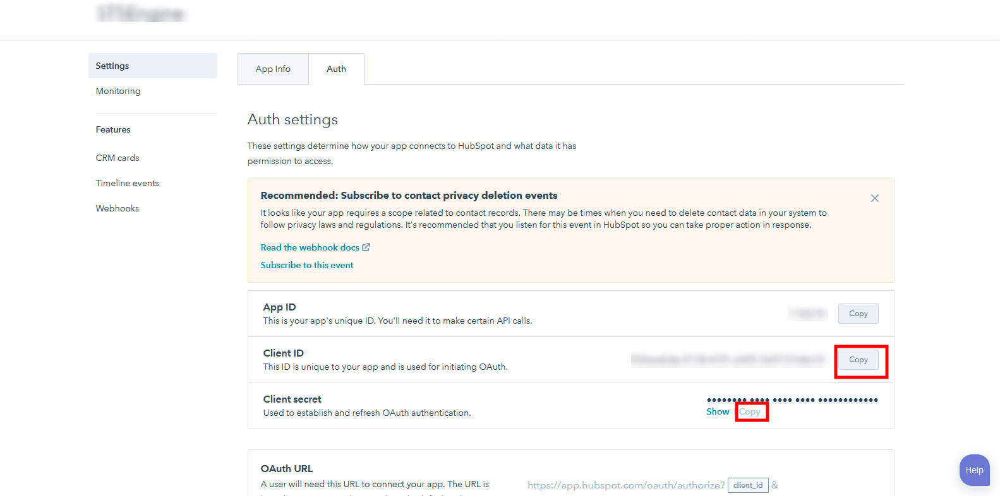

Hubspot
==============

==============
Create Hubspot Application
==============

- Create a new Hubspot Developer Account in https://app.hubspot.com/signup/developers
- Access Hubspot Developer Site with this account.
- Select Apps >  Create Application, fill all required filed in the popup.

- Switch to Auth tab, scroll down the form to view the Scopes section, select 3 scopes: Forms, Contacts, Basic Oauth Functionality.

- Click Save.

- Back to Apps, select your created application

- From the application form, copy client_id and client_secrect.

==============
Integrate with your site
==============

Open Administration page, navigate to Settings->Integrations. Scroll to the Hubspot form and fill required information.

