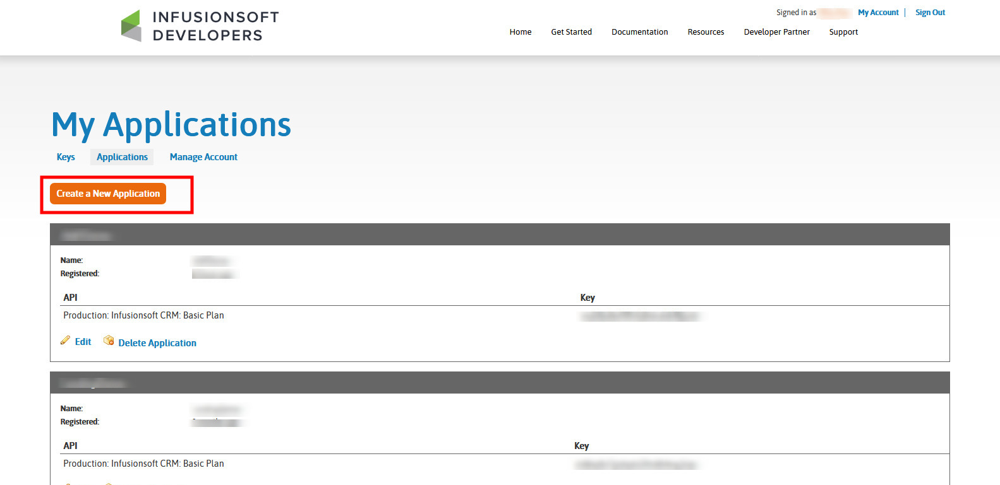
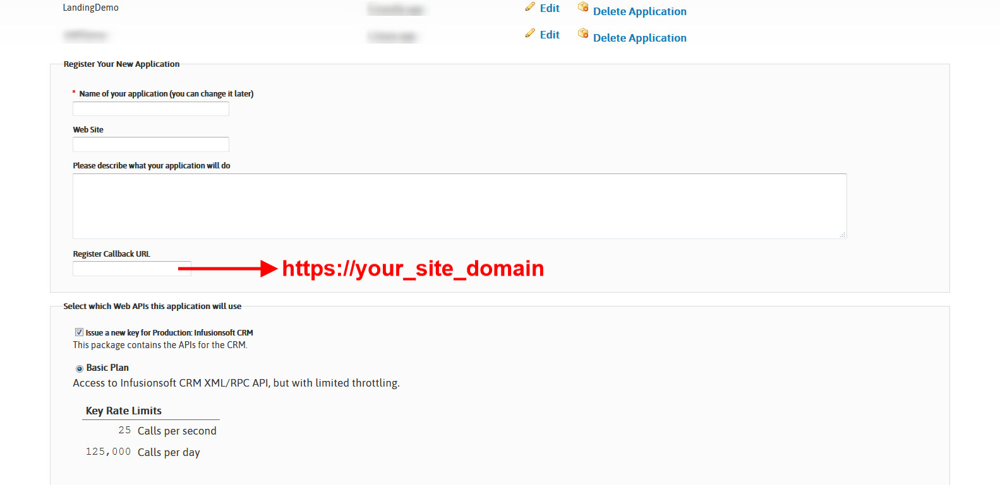
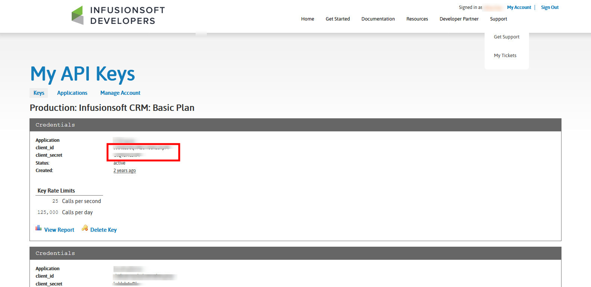
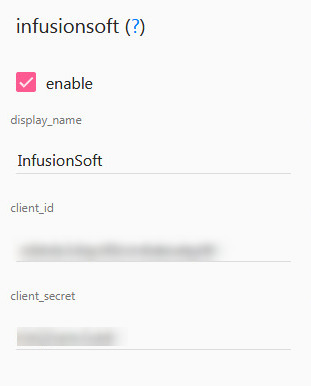

Infusionsoft(Keap)
==============

.. Note:: Your site must run under https to allow InfusionSoft integration.

==============
Creating InfusionSoft Developer Account
==============

- Create new developer account with https://keys.developer.infusionsoft.com/member/register

==============
Creating an InfusionSoft Application
==============

- Use your developer account to login https://keys.developer.infusionsoft.com/apps/myapps
- Click Create New Application.

- Fill all informations in the register form and click Submit
    - Name of your application: any name.
	- Register Callback URL : https://your_site_domain

- Click Register Application.

- Go back to https://keys.developer.infusionsoft.com/apps/mykeys
- Copy Client Id and Client Secret of your application.

==============
Integrate with your site
==============

Open Administration page, navigate to Settings->Integrations. Fill the InfusionSoft form with following value:

   - Client Id
   - Client Secret

