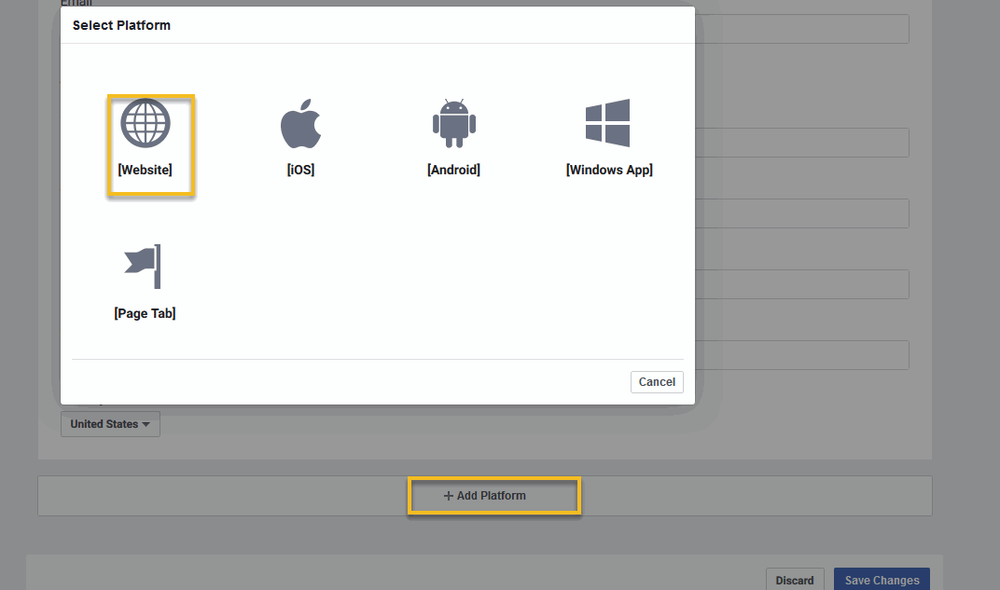

Facebook App
==============

==============
Creating a Facebook App
==============

1. Log in to your Facebook account.
2. Go to https://developers.facebook.com/ click on My Apps and press Create App.

3. Select Manage Bussiness Integration.Click Continue.

4. Set the Display Name of your application.

5. Enter the Contact Email.
6. Select App Purpose is Clients. Click Create app.

==============
Configuration Facebook Login
==============
1. New app is created. Click Product
2. Navigate to Facebook Login, click Setup.

3. Select Web from the displayed platforms.

4. Go to the Settings section and choose Basic.
5. In the Settings Form, fill some required field: Privacy URL, App Domains, Contact Email, App Icons.

6. Scroll down to bottom of the page,click Add Platform.
7. Select Website from the list.
8. Set the website URL address in the Site URL field and press the Save Changes button.

.. image:: ../assets/images/facebook_app8.gif

9. Navigate to Facebook Login section and press Settings.
10. Set value of Valid OAuth Redirect URIs to following Url: https://yourdomain.com/login/facebook/callback
11. Click Save Changes.

==============
Configuration Messenger
==============

1. Click Product
2. Scroll to Messenger section, click Setup.

==============
Configuration Webhook
==============

1. Click Product
2. Scroll to Webhook section, click Setup.

