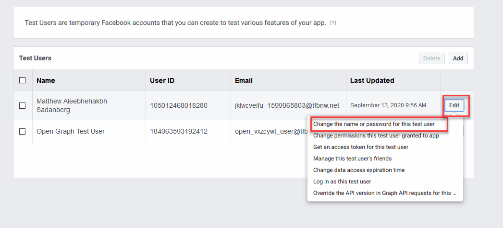
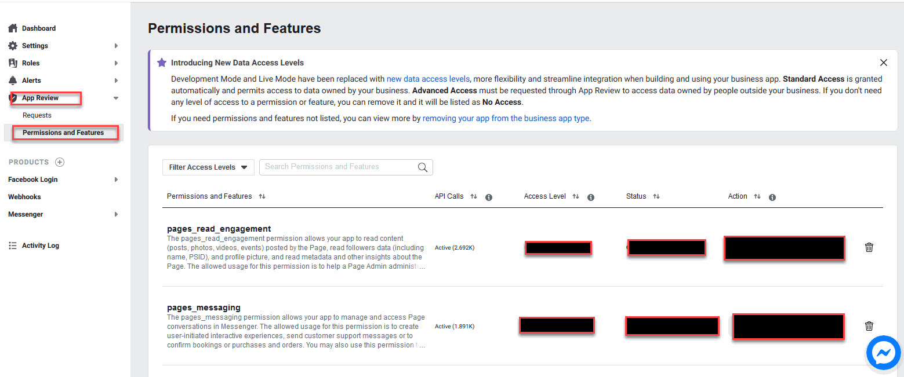

Facebook App APPROVAL
==============

==============
How to submit a Facebook app for review
==============

You will need below permission to run ChatbotPB core features.
| pages_manage_engagement
| pages_read_user_content
| pages_manage_posts
| pages_manage_metadata
| pages_read_engagement
| pages_show_list
| pages_messaging
| Business Asset User Profile Access
| pages_user_gender
| pages_user_locale
| pages_user_timezone

==============
Create Test User
==============
1. Go to https://developers.facebook.com/apps/

2. Open your App.

3. Select Roles -> Test Users from the displayed platforms.

4. Next, in the Test Users page, click Add button.

5. In next dialog, click Create Test Users
6. After the test user created, back to the User list, click Edit button on the relevant user, select Change The name or password for this test user

7. Set new password for this user and click Update. Copy the User and Password.

8. Back to the User list, click Edit again, select Change Permissions this test user granted to this app.
9. Choose following permissions and click Update
| email
| public_profile
| pages_show_list
| pages_messaging
| pages_read_engagement
| pages_manage_metadata
| pages_read_user_content
| pages_manage_engagement

==============
Create Test Page
==============

1. Still in the User list, click Edit on the Test user, select Log in as this test user and complete the confirmation flow.

2. Create a Facebook Page with the logged-in test user.

==============
Submit App Approval Request
==============

1. Back to the App main page, select App Review -> Permissions and Features

2. Click Request Advance Access foreach following permissions: 
| pages_manage_engagement
| pages_read_user_content
| pages_manage_posts
| pages_manage_metadata
| pages_read_engagement
| pages_show_list
| pages_messaging
| Business Asset User Profile Access
| pages_user_gender
| pages_user_locale
| pages_user_timezone

2. select App Review -> Request, insert content foreach permissions. Create demo screencast with your test account if this permission required.

==============
Approval Content
==============

1.App Verification 

Hi, Please check my system below credential

https://chatbot.stsengine.com

Test account: test user email and test user password (copied from previous step)

	1. User login to our system with their facebook credentials
	2. Click on Dashboard on the top menu.
	3. Click on a relevant Bot item.
	4. Next page, select Dashboard menu from the left sidebar.
	5. Click Connect to a facebook page button.
	6. System will get list of user's page. Users will select a facebook page and click Connect, system will fetch facebook page information, access token and subscribe this page to webhooks for Bot.
	7. After connected to a FB page, users will navigate to Conversation section. They will define messages they want Chatbot to response to Subsciber.
	With Chatbot, it can auto reply user message, send message to user within 24 hours, auto reply when users comment on page.

	
2. Page Show List

	1. User login to our system with their facebook credentials
	2. Click on Dashboard on the top menu.
	3. Click on a relevant Bot item.
	4. Next page, select Dashboard menu from the left sidebar.
	5. Click Connect to a facebook page button.
	6. System will get list of user's page. Users will select a facebook page and click Connect.
	7. System will fetch facebook page information, access token and subscribe this page to webhooks for Bot.
	
3. Page Manage Metadata
	1. User login to our system with their facebook credentials
	2. Click on Dashboard on the top menu.
	3. Click on a relevant Bot item.
	4. Next page, select Dashboard menu from the left sidebar.
	5. Click Connect to a facebook page button.
	6. System will get list of user's page. Users will select a facebook page and click Connect.
	7. System will fetch facebook page information, access token and subscribe this page to webhooks for Bot.
	
4. pages_user_locale

	Our app is used by all over the world & and we will send message in a different languages, that’s why we need user locale for personalize experiences based on the locale of a person by surfacing locale specific content. Send responses in the preferred language of the person, display thier times, and dates correctly for the locale of the person.

	1. User login to our system with their facebook credentials
	2. Click on Dashboard on the top menu.
	3. Click on a relevant Bot item.
	4. Next page, select Conversation menu from the left sidebar.
	5. Click on Welcome Message item.
	6. Add a Redirect Block block. Add a new filter item and redirect user to Vietnamese content if their locale is Vietnamese.
	
5. pages_user_gender
	We need user gender to show them their personalize experiences & recommendations based on the gender & also for using gendered language such as correct pronouns and titles.

	1. User login to our system with their facebook credentials
	2. Click on Dashboard on the top menu.
	3. Click on a relevant Bot item.
	4. Next page, select Conversation menu from the left sidebar.
	5. Click on Welcome Message item.
	6. Add a Redirect Block block. Add a new filter item and redirect user to Male content if their gender is Male.
	
6. pages_user_timezone
	We want to send messages to our users at a specific time at their own time zone and prevent messages from being sent at of their inconvenient time.

	1. User login to our system with their facebook credentials
	2. Click on Dashboard on the top menu.
	3. Click on a relevant Bot item.
	4. Next page, select Broadcast menu from the left sidebar.
	5. Click Add Broadcast button.
	6. Click on the created Broadcast item.
	7. Select Settings tab, select Send Later option.
	8. Next, in the timezone dropdown, select User Timezone.

	With these settings, Bot will send message to user at a specific time at their timezone.

7. Business Asset User Profile Access
	This permission is necessary for our app to get subscriber first name, last name & picture those who send message to our customer messenger BOT. Messenger BOT need this permission for reply to them personalized way.

	1. User send message to page.
	2. Our system collect data like First Name, Last Name, Profile Picture from PSID to reply them with proper personalized way.
	3. Messenger subscriber information like First Name, Last Name, Profile Picture, Gender is stored in Dashboard -> Bot item -> Audience
	
8. pages_read_user_content
	1. User login to our system with their facebook credentials
	2. Click on Dashboard on the top menu.
	3. Click on a relevant Bot item.
	4. Next page, select Dashboard menu from the left sidebar.
	5. Click Connect to a facebook page button.
	6. System will get list of user's page. Users will select a facebook page and click Connect, system will fetch facebook page information, access token and subscribe this page to webhooks for Bot.
	7. Next, select Comment menu from the left sidebar.
	8. In the Comment page, click Add button to create a new Comment Rule.
	9. Users can like, hide, remove a offensive comment. They also can make a private reply to the subscriber.

9. pages_messaging
	| Tell us how you're using this permission or feature
	
	1. User login with their facebook accounts.
	2. Click Create new blank bot button.
	3. Now there is a new chatbot item created, user click on this item to edit.
	4. Next, in the bot details page, click Dashboard on the left sidebar menu.
	5. Click Connect to a page button.
	6. Next page, system will get list of facebook pages which managed by this user. Users will choose a facebook page they want to connect with Chatbot then click Connect.
	7. After connected to a FB page, users will navigate to Conversation section. They will define messages they want Chatbot to response to Subsciber.
	
	| Please provide step-by-step instructions to walk us through how to test this integration.
	| Test account test user email and test user password
	| Test page link: link to your facebook page messenger( m.me/...)
	1. Access to the test page. 
	2. Login with this test account. 
	3. Send "Hi" to Bot. Bot will reply "Hi.Thank you for message us" 
	4. Send "Info" to Bot. Bot will reply "Hi. We are Chatbot team" 
	5. Send "Support" to Bot. Bot will reply "Hi. What is your question?" 
	
	Note: you must setup BOT for this page and ensure Bot will reply same as this script
	
10. pages_manage_engagement
	1. User login to our system with their facebook credentials
	2. Click on Dashboard on the top menu.
	3. Click on a relevant Bot item.
	4. Next page, select Dashboard menu from the left sidebar.
	5. Click Connect to a facebook page button.
	6. System will get list of user's page. Users will select a facebook page and click Connect, system will fetch facebook page information, access token and subscribe this page to webhooks for Bot.
	7. Next, select Comment menu from the left sidebar.
	8. In the Comment page, click Add button to create a new Comment Rule.
	9. Users can like, hide, remove a offensive comment. They also can make a private reply to the subscriber.

11. pages_read_engagement
	1. User login to our system with their facebook credentials
	2. Click on Dashboard on the top menu.
	3. Click on a relevant Bot item.
	4. Next page, select Dashboard menu from the left sidebar.
	5. Click Connect to a facebook page button.
	6. System will get list of user's page. Users will select a facebook page and click Connect, system will fetch facebook page information, access token and subscribe this page to webhooks for Bot.
	7. Next, select Comment menu from the left sidebar.
	8. In the Comment page, click Add button to create a new Comment Rule.
	9. Select Post Type is Specific Post.
	10. Next, click Select Post button.
	11. A popup with a list of Facebook Posts of this Page will show.
	12. User select a Post then click Select