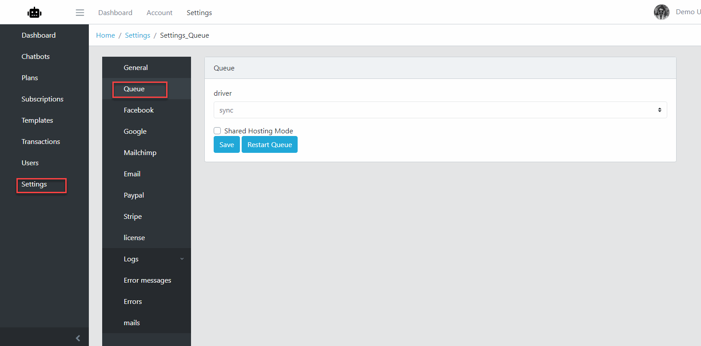

Configuration Queue and Job
==============

Chatbot utilize a feature of Laravel is Queue to send Facebook Message.

==============
Running Queue
==============

1. If you installed Supervisor, just start this service then Laravel Queue will running.
2. If not, running following command
	| php artisan queue:work

==============
Configuration Queue
==============

1. Login to Admin->Settings->Queue.

2. Change the Driver dropdown to Database.
3. Click Save

- Button Restart Queue: use when you modify the source code, then click this butotn to update current to the Queue.
- Checkbox Shared Hosting Mode: check when you can start Laravel Queue using Command Console.