Chatbot Cards
==============

==============
Text Card
==============

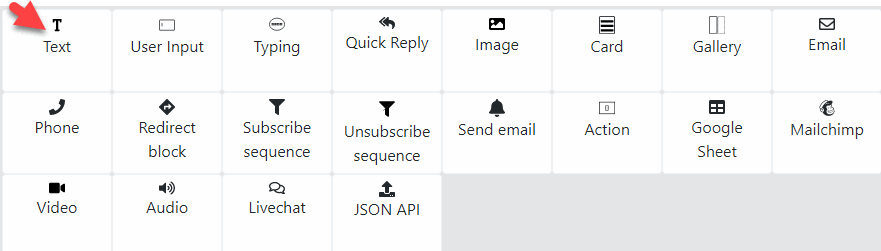

1. Text

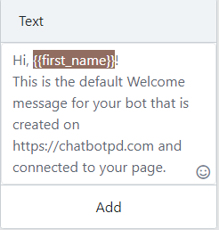

- Send Text Message to Subscriber.
- To add subscriber attribute, type { to display list of subscriber attribute, select an attribute from the list.
- To add system attribute, type [ to show list system attribute.

2. Emoji

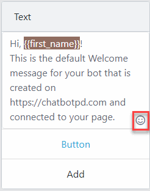

- Click to the Emoji button on the bottom right of the Text Card.
- Select an Emoji in the Emoji Dialog.

3. Button

- Create button to allow click and do some certain actions.
- Support 3 types of action:
	- URL: Open the URL.
	- Phone: Call Customer Phone.
	- Redirect Block: Send another Block to Customer.

- Click Add button in the Text card

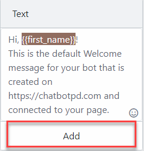

- Next, a Button Dialog will appear. Fill the Button Text, select Action then Click OK to save the Button

.. image:: ../assets/images/card_text2.gif

==============
Input Card
==============

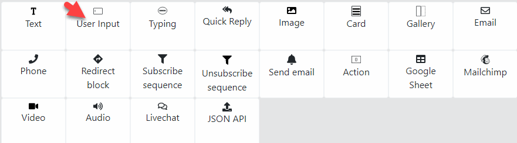

- Create a question for subscriber and save the answer to an attribute.

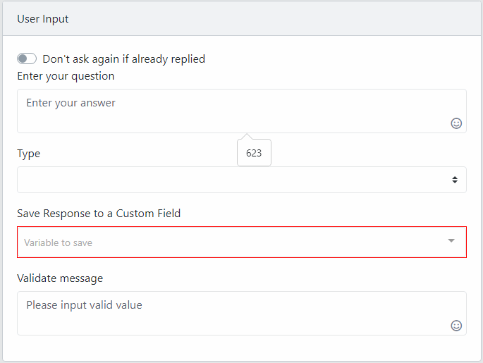

- Type: validate the answer, default is Text
	- Email: require answer is an email.
	- Phone: requie answer is a phone number.
	- Number: answer must be a number.
	- URL: answer must be an URL( begin with http or https).
	- Date/Datetime: validate for Date/ Date with time value.
	- File/Image/Audio/Video: users must send a file through messenger.
	- Location: the answer must contain location value( long, lat).
	
- Save reponse to a Custom Field: select a custom attribute to send the answer to.

- Validate Message: message to user when their answers invalid.

==============
Email Card
==============

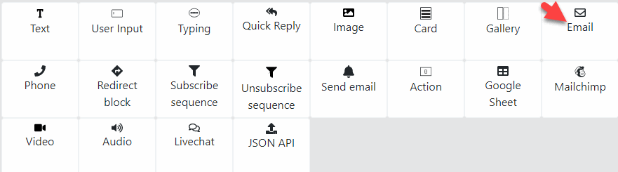

- Same as Input Card but it save the answer to System Email field of subscriber

==============
Phone Card
==============

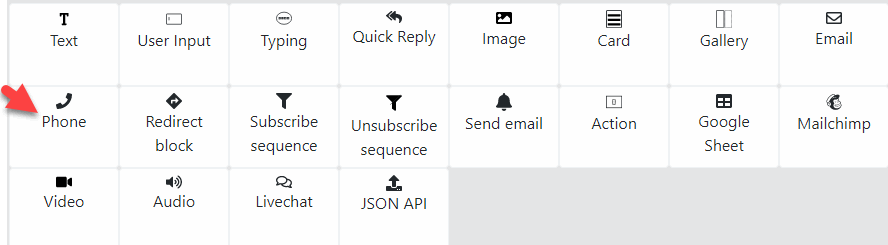

- Same as Input Card but it save the answer to System Phone field of subscriber

==============
Livechat Card
==============

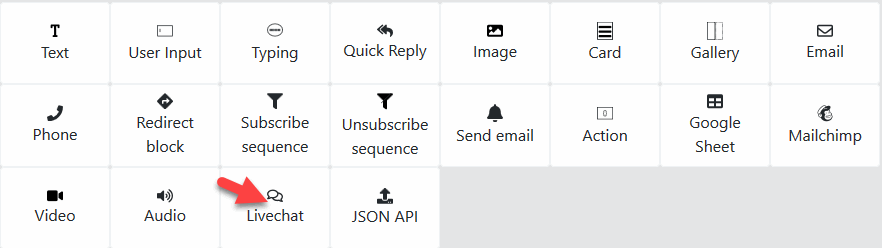

1. Livechat Card

.. image:: ../assets/images/card_livechat.gif

- If Customer want to direcly chat with a Human, put this card to your Chatbot
- This card pause Chatbot for a subscriber and send the conversation to an Admin.
- Start Message: Message send to user when the Chatbot paused and the livechat with human is started.
- Stop Message: Chatbot with this user is resume and notify user with this message.

- Timeout: the amount of time Livechat Human waiting for user reply. After this time with no response from user, Chatbot will resume and process the conversation with this user.
2. Livechat Tab

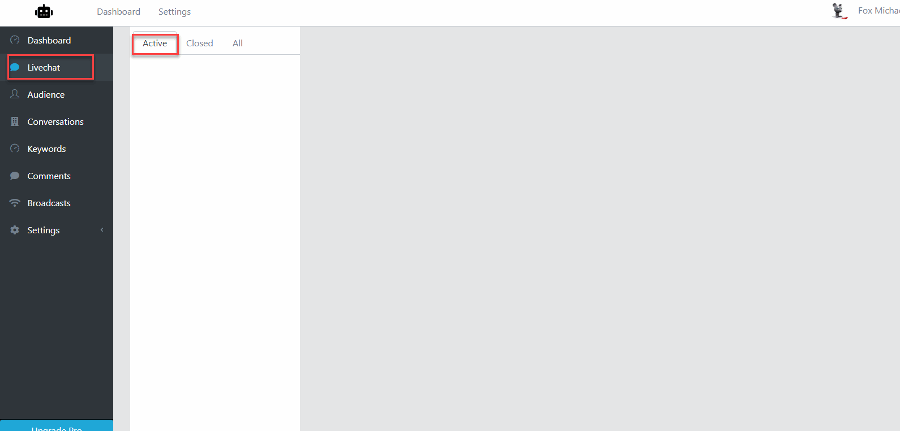

- When a Livechat run, Chatbot will send a Facebook Message to Page Admin with a link to the Livechat Tab.

- Customers in Livechat will display in the Active Tab.

==============
Action Card
==============

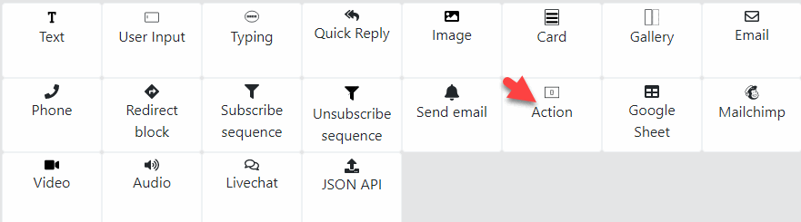

- Define a list of actions:
- Set/Remove User Attribute
- Subscribe/Unsubscribe subscriber.

==============
Redirect Block Card
==============

- This card routes subscriber to a specific or random Block.
- User can filter the route base on user attribute.
 
==============
Subscribe Sequence/ Unsubscribe Sequence
==============

- Subscribe/ Unsubscribe a subscriber to a sequence.
- User can filter the route base on user attribute.

==============
Json Api
==============

- Send a HTTP GET or POST request to a specific URL.

1. Response Example
The API Enpoint should send a json response contain a list of Messages Chatbot will send to Customer.

	.. code-block:: JSON
	
	{
		"messages":[
			"message here"
		
		]
	}
	- Simple Text:
		.. code-block:: JSON
		
			{
				"type":"text",
				"text":"Json Api text"
			}
		
	- Text with Button:
		.. code-block:: JSON
		
			{
				"type":"text",
				"text":"Json Api text",
				"buttons":[
					{
						"label":"Email",
						"type":"redirect_block",
						"block":"block_id"
					},
					{
						"label":"Email",
						"type":"open_url",
						"url":"url"
					},
					{
						"label":"Phone",
						"type":"phone",
						"phone":"phone"
					}
				]
			}
		
		- Card
		.. code-block:: JSON
		
			{
				"type":"card",
				"text":"Test card",
				"subtext":"Card Subtext",
				"image.src":"source_url", 
			}
		- Gallery
		.. code-block:: JSON
		
			{
				"type":"gallery",
				"elements":[
					{
						"text":"Test card",
						"subtext":"Card Subtext",
						"image.src":"source_url"
					},
					{
						"text":"Test card",
						"subtext":"Card Subtext",
						"image.src":"source_url"
					}
				]
			}
		- Quick Reply
		.. code-block:: JSON
		
			{
				"type":"quick_reply",
				"variable":"variable",
				"buttons":[
					{
						"label":"Email",
						"type":"text"
					},
					{
						"label":"Email",
						"type":"email"
					},
					{
						"label":"Phone",
						"type":"phone"
					}
				]
			}

==============
Google Sheet
==============

- Send Subscriber attribute to Google Sheet

1. Connect your Google Account

2. Select a Google Sheet

3. Setup Fields

==============
Mailchimp
==============

- Send Subscriber attribute to Mailchimp

1. Connect your Mailchimp Account

2. Select a Mailchimp List

3. Setup Fields

==============
Send Email
==============

- Send an email to a specific email or user email if collected.
