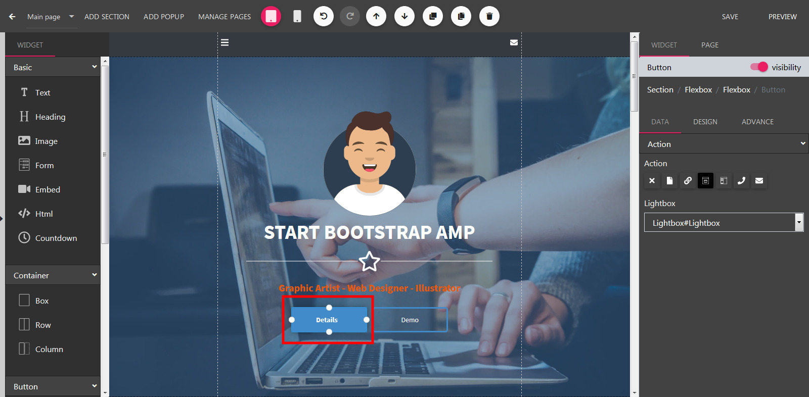

Chatbot Cards
==============

==============
Text Card
==============

- Open the Builder.
- On the left sidebar, drag a module icon in the the builder canvas.
.. image:: ../assets/images/addmodule.jpg

==============
Input Card
==============

- On the builder canvas, left click into a module to change it to edit mode

==============
Email Card
==============
- Click to a Module to open Edit Mode. Press Duplicate to remove this module from canvas.
.. image:: ../assets/images/duplicatemodule.jpg

==============
Phone Card
==============
- Click to a Module to open Edit Mode. Press Delete to remove this module from canvas.
.. image:: ../assets/images/deletemodule.jpg

==============
Livechat Card
==============

==============
Livechat Card
==============

