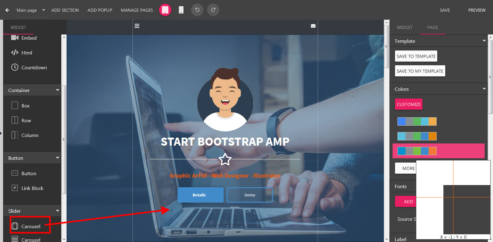
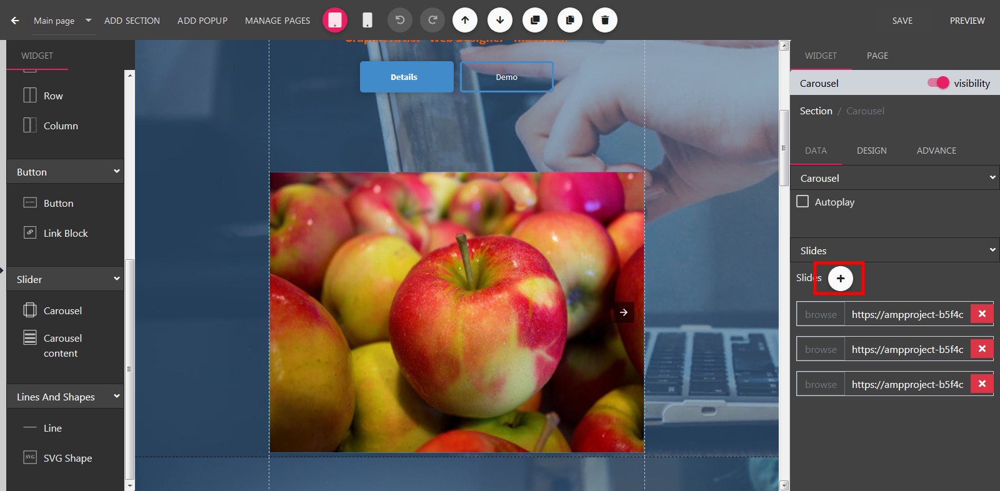
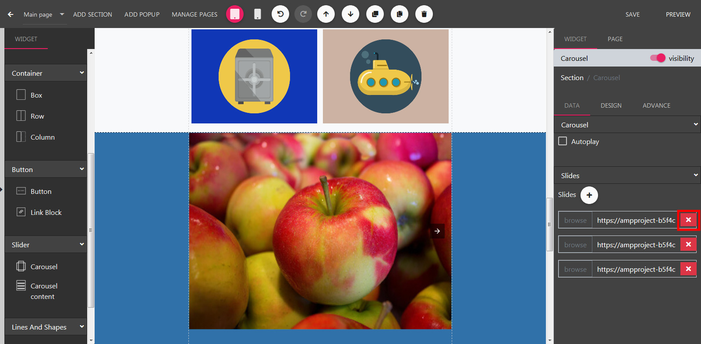
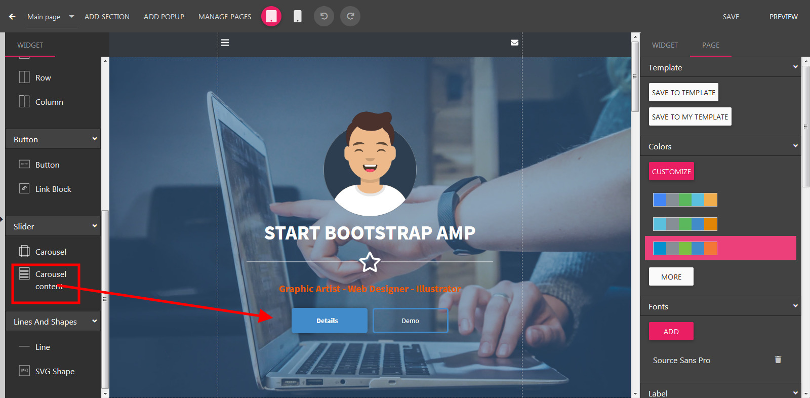

Carousel
==============

==============
Adding a Carousel
==============

- Open the Builder, drag the Carousel widget to the builder canvas.

==============
Adding new Slide
==============
- Select a Carousel in the Builder.

- On the right panel, scroll down to show to Slides section

- Click Add Slide button.
- Select an image and click Select.

==============
Delete a Slide
==============
- Select a Carousel in the Builder.

- On the right panel, scroll down to show to Slides section

- Click Remove button on relevant slide.
==============
Adding Carousel Content
==============
- Select a Carousel in the Builder.

- Drag the Carousel widget to the relevant Carousel.

- Next, you can drag Text or Button into this content.

