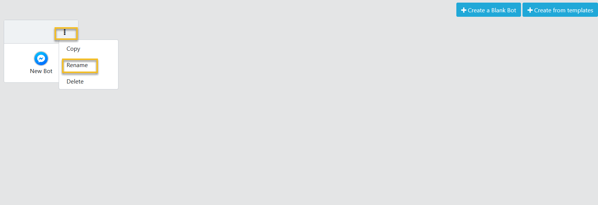
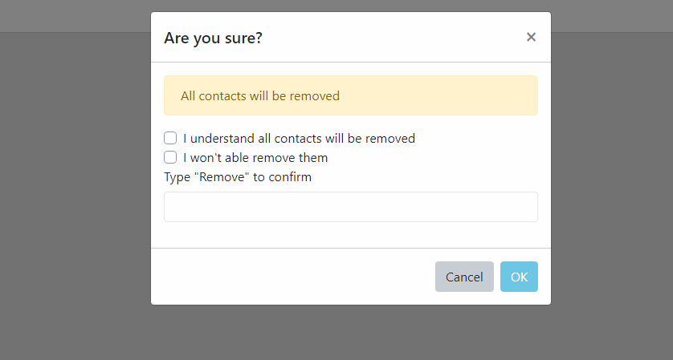
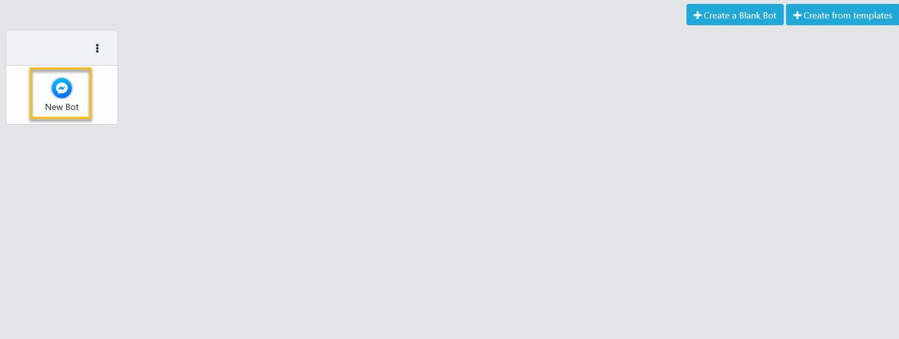
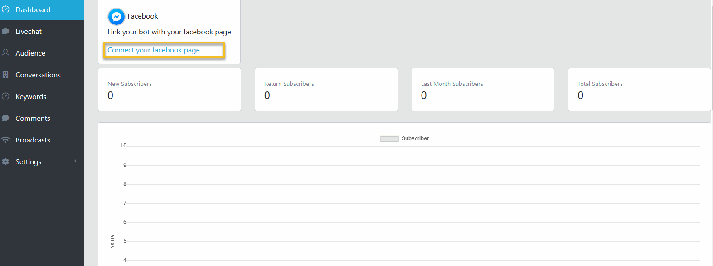
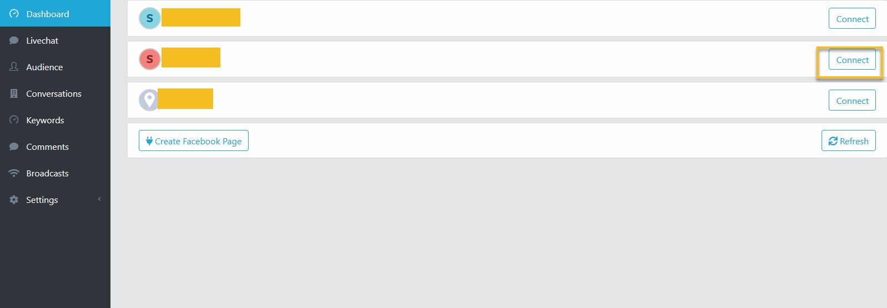
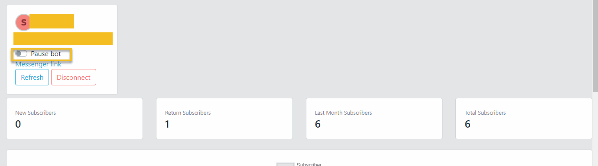

Chatbot
==============

==============
Create Chatbot
==============

- Login with a Facebook account.
- Click Dashboard.
- Click Create a Blank Bot button

.. image:: ../assets/images/chatbot.jpg

==============
Rename Chatbot
==============

- Login with a Facebook account.
- Click Dashboard.
- On the relevant Bot item, click 3 dots button then select Rename

- Set your new chatbot name and click Check button to save.

==============
Delete Chatbot
==============

- Login with a Facebook account.
- Click Dashboard.
- On the relevant Bot item, click 3 dots button then select Delete

 
- In the Confirm dialog, choose OK.

==============
Connect Chatbot to a Facebook page
==============

- Login with a Facebook account.
- Click Dashboard.
- Click to a relevant Bot item to open Bot Dashboard.

 
- In the Bot Dashboard page, click Connect to a facebook page.

- Next page, select a relavant Facebook page, click Connect

==============
Pause Chatbot
==============

- Login with a Facebook account.
- Click Dashboard.
- Click to a relevant Bot item to open Bot Dashboard.
- Switch the Pause bot checkbox to true.

