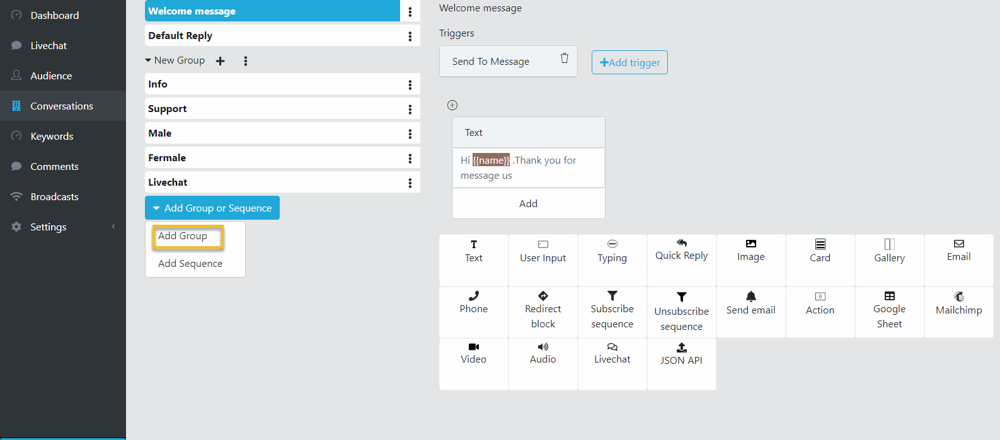
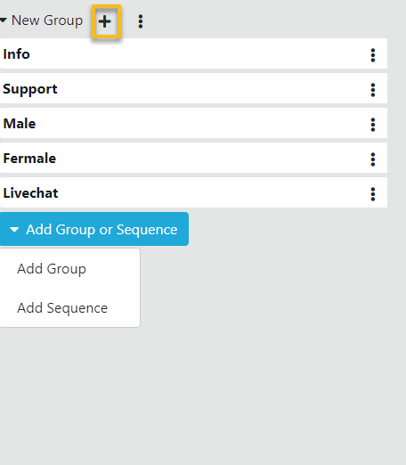
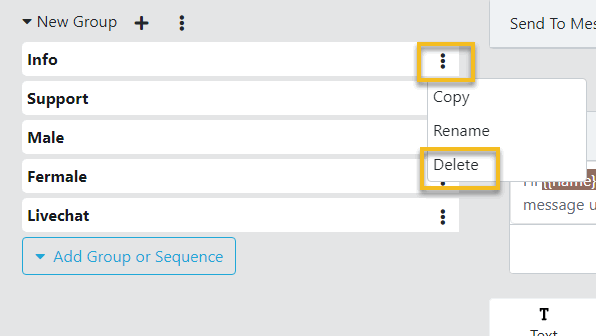
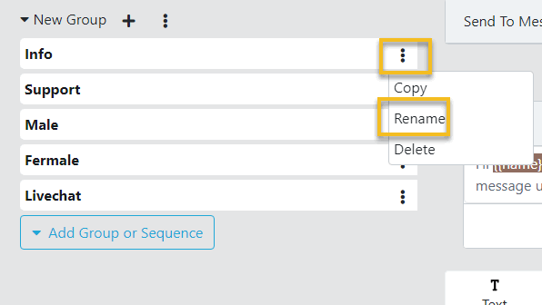

Conversation
==============

==============
Add a Conversation
==============

- Open a Bot Dashboard.
- Click  Conversations from the left menu.

.. image:: ../assets/images/conversation.gif

- Click Add group or Sequence button. Select Add Group.

- A new Conversation Group is added, click the plus button on this group.

==============
Remove a Conversation
==============

- In the Conversation page, click the 3 dots button on the Conversation to delete.
- Click Delete. Then click OK to remove this conversation. 

==============
Rename a Conversation
==============

- In the Conversation page, click the 3 dots button on the Conversation to rename.
- Click Rename. Set the new name to the Conversation and click Check button.

.. image:: ../assets/images/rename_conversation2.gif

