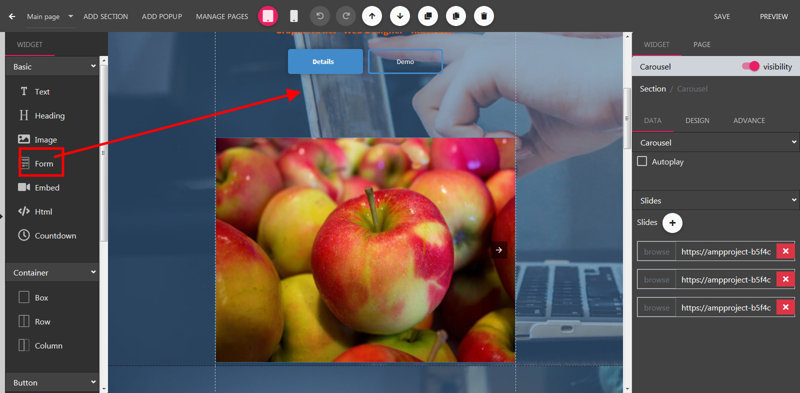
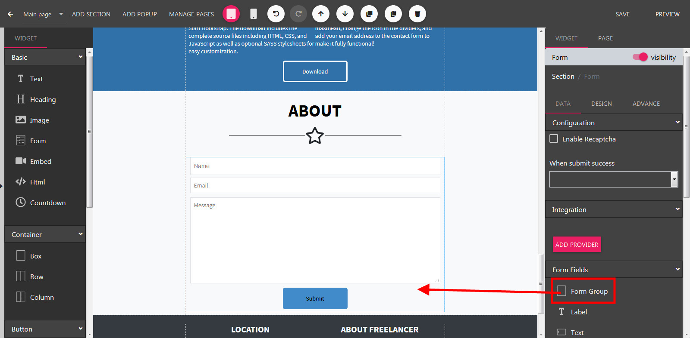
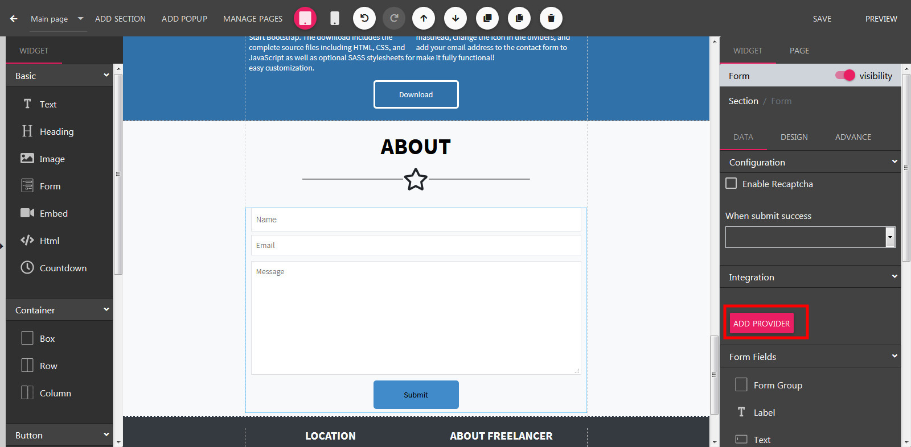
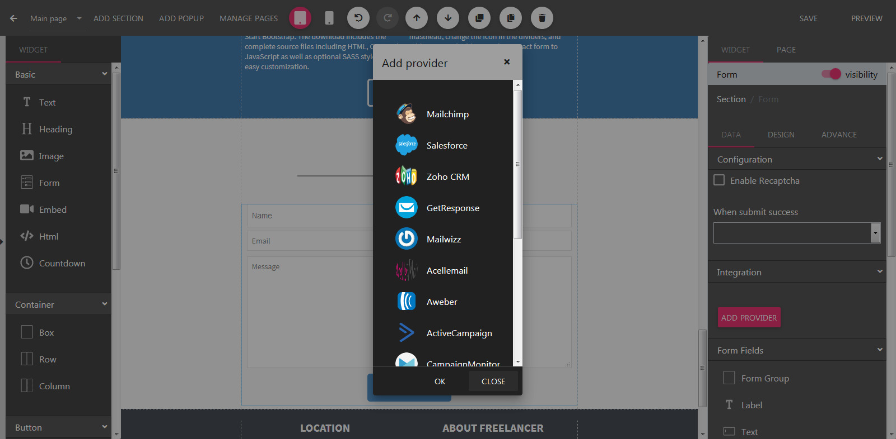

Form
==============

==============
Adding a Form
==============

- Open the Builder, drag the form widget to the builder canvas.

==============
Adding Form Fields
==============
- Select a Form in the Builder.

- On the right panel, scroll down to show to Form Fields section

- Drag relevant form field into your form.

==============
Form Integrations
==============
Form data submitted by user can be sent to 3rd party services (such as MailChimp, AWeber, GetResponse, etc.)

- Select a Form in the Builder.
- On the right panel, scroll down to show to Integrations section, click Choose Provider button.

- In the Integration dialog, click your prefer service.

- Follow the next dialog to complete the integration.
