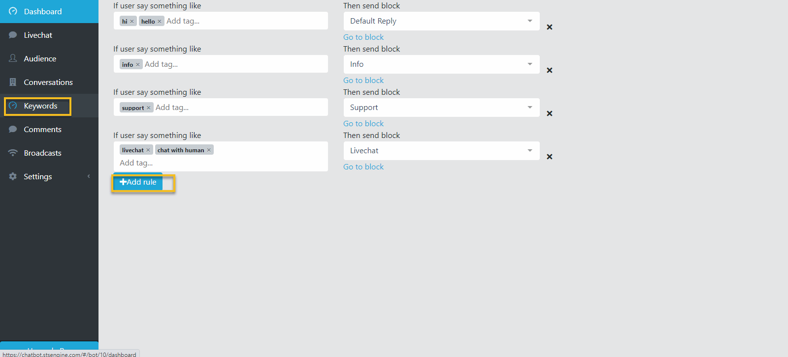

Chatbot Keywords
==============

Make the AI recognise specific phrases, emojis and the big blue thumbs up a user enters and reply with a relevant answer.

==============
Adding Keywords
==============

- In the Bot Dashboard page, select Keywords from the left menu.

- Then, enter phrases which should trigger a specific response from the bot. Select a Conversation Block to send to user.

