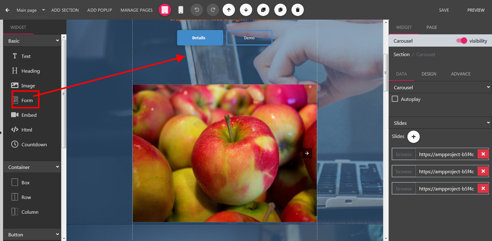
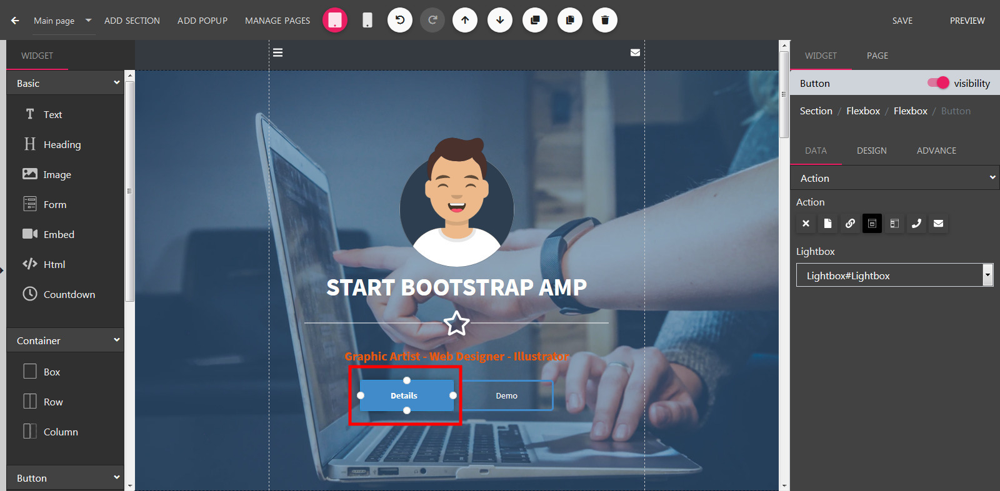
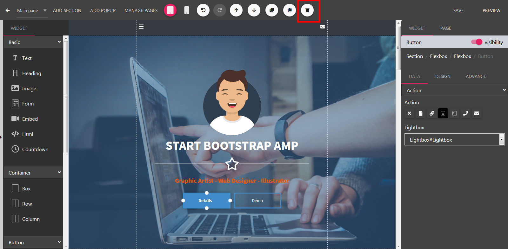

Module
==============

==============
Adding a Module
==============

- Open the Builder.
- On the left sidebar, drag a module icon in the the builder canvas.

==============
Editting a Module
==============

- On the builder canvas, left click into a module to change it to edit mode

==============
Duplicate a Module
==============
- Click to a Module to open Edit Mode. Press Duplicate to remove this module from canvas.
.. image:: ../assets/images/duplicatemodule.jpg

==============
Delete a Module
==============
- Click to a Module to open Edit Mode. Press Delete to remove this module from canvas.

