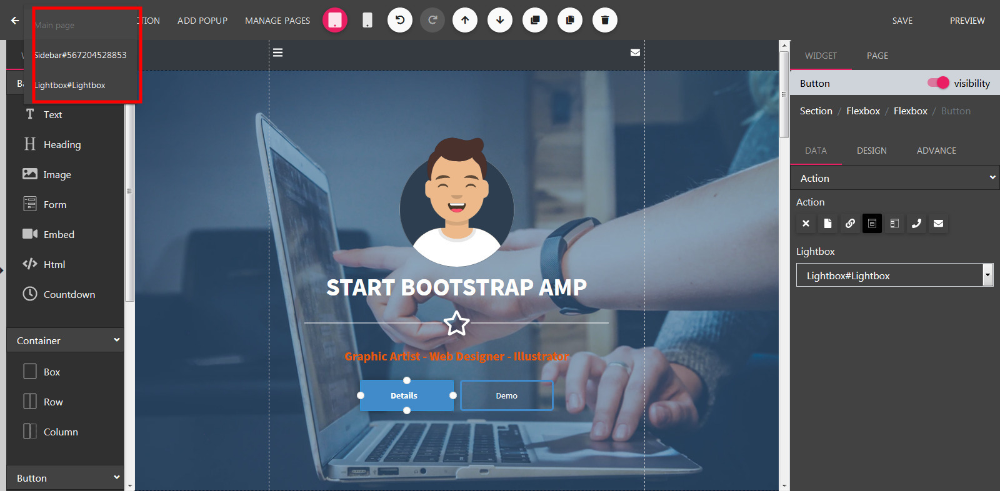

Popup
==============

==============
Adding a Popup
==============

- Open the Builder, click Add Popup button located on left side of the header.

- Next, select your prefer popup type:
	- Sidebar: show from left or right side of the browser.
	- Notification: show when user visits this page.
	- Lightbox: show when user clicked a button.

.. image:: ../assets/images/addpopup.jpg

==============
Edit a Popup
==============

- Still in the builder, click the Page Tabs dropdown located on the header
- Select a popup on the menu dropdown.

==============
Toogle a Sidebar or Lightbox
==============

- Drag a Button or a SVG Shape from the left sidebar to builder.

.. image:: ../assets/images/addbutton.jpg

- Left click into this new module to change it to edit mode.
- On the right panel, scroll down to show to Action section

- In the Action dropdown, Select Open a Sidebar or Open a Popup. Then select relevant popup in the next dropdown.

.. image:: ../assets/images/buttonaction.jpg
