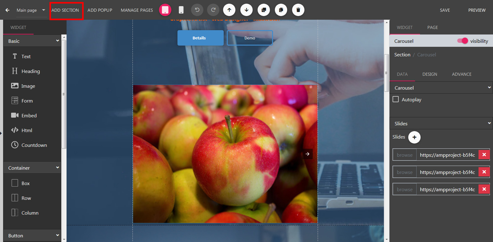
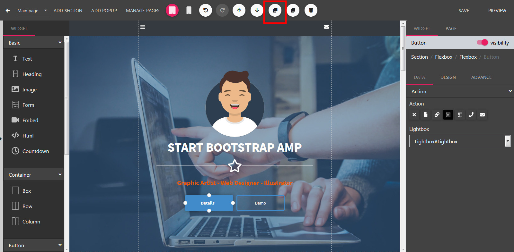

Section
==============

==============
Adding a Section
==============

- Open the Builder, click Add Section button located on left side of the header.

- Next, in the Templates dialog, select your prefer section template, click Select button.

==============
Duplicate a Section
==============

- Still in the builder, scroll to reveal the section you want to duplicate.
- Move the mouse to an empty point in this section then click.
- Now, click the Duplicate button.

==============
Section Properties
==============

**Border**

Set border color, stroke and add a corner radius.

**Box shadow**

Add shadow to your section.
**Label Properties**

Set text properties such as color, font style. It will apply for every new text widget added to this section.

**Background**

Set background color, image. Support gradient color.
