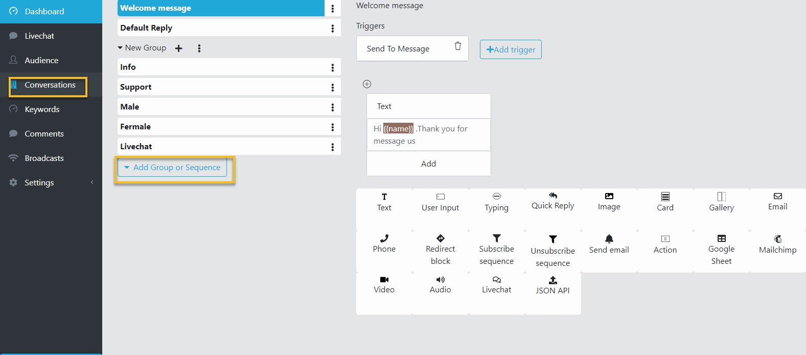
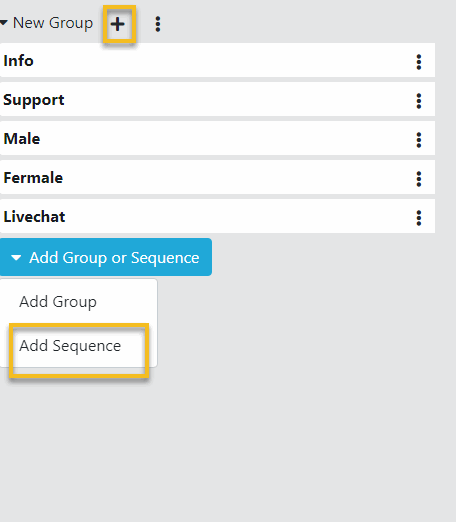
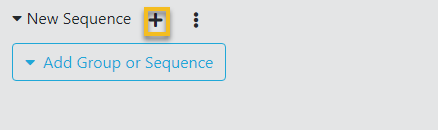
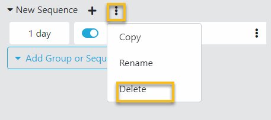
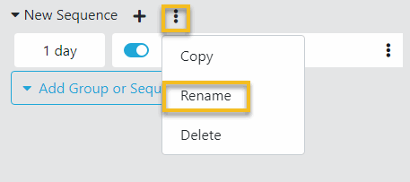
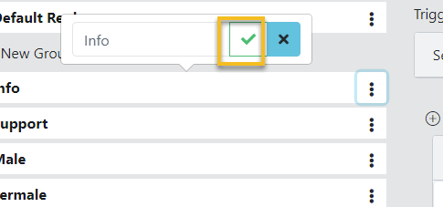
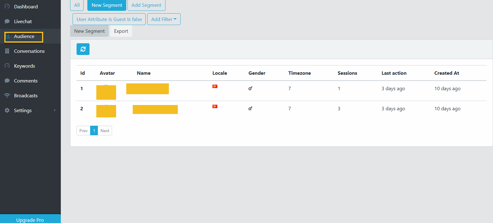

Chatbot Sequence
==============

Sequences are blocks of follow-up messages you can send after a certain period of time.

==============
Add a Sequence
==============

- Open a Bot Dashboard.
- Click  Conversations from the left menu.

- Click Add group or Sequence button. Select Add Sequence.

- A new Sequence is added, click the plus button to a Sequence Block to this Sequence.

==============
Remove a Sequence
==============

- In the Conversation page, click the 3 dots button on the Sequence to delete.
- Click Delete. Then click OK to remove this conversation. 

==============
Rename a Sequence
==============

- In the Conversation page, click the 3 dots button on the Conversation to rename.
- Click Rename. Set the new name to the Conversation and click Check button.

==============
Subscribe a Customer to a Sequence
==============

- Open a Bot Dashboard.
- Click  Audience from the left menu.

- Click on the relevant subscriber.
- Next, in the Subscriber Info Dialog, click Subscribe.
- Select a Sequence to add subscriber to.

