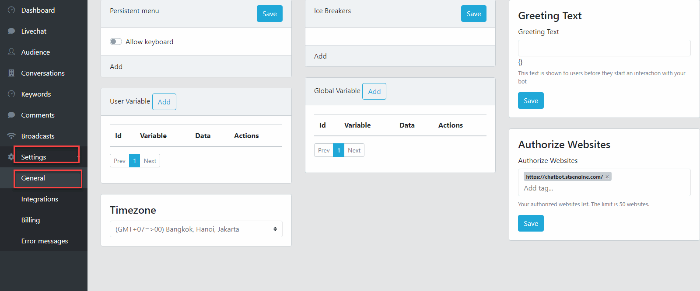
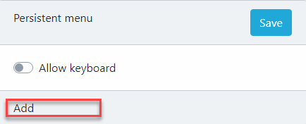
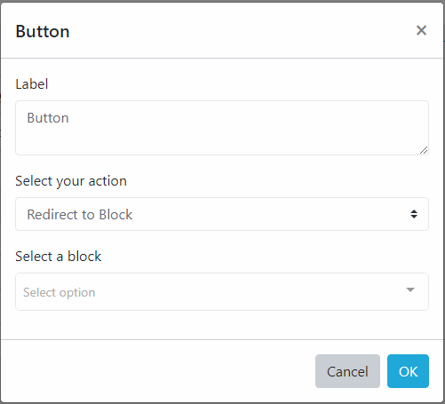
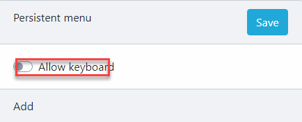
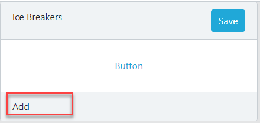
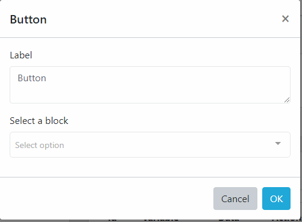
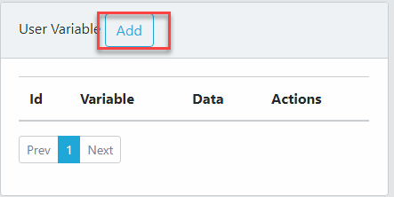

Chatbot Settings
==============

==============
Persistent Menu
==============

1. Add Button

- In the Persistent Menu area, click Add button.

- Next, a Button Dialog will appear. Fill the Button Text, select Action then Click OK to save the Button

2. Enable User Input

- Check the Allow Keybord to allow User free typing.

==============
Ice Breakers
==============

1. Add Button

- In the Persistent Menu area, click Add button.

- Next, a Button Dialog will appear. Fill the Button Text, select a Conversation then Click OK to save the Button

==============
Chatbot User Custom Field
==============

1. Add a Custom Field

- On the Custom Field area, click Add

- Set the name for the Custom Field and Click OK.

2. Rename Custom Field
- You can't rename a custom field

3. Delete a Custom Field
- Click the Trash button on the Custom Field you want to delete, click Ok to confirm.

==============
Chatbot System Data
==============

1. Add a System Data

- On the Custom Field area, click Add

- Set the name for the Custom Field and Click OK.

2. Rename System Data
- You can't rename a custom field

3. Delete a System Data
- Click the Trash button on the System Data you want to delete, click Ok to confirm.

