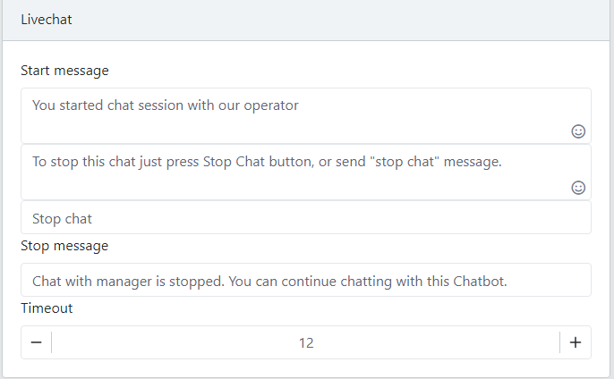

Chatbot Settings
==============

==============
Persistent Menu
==============

.. image:: ../assets/images/general_settings.gif

1. Add Button

- In the Persistent Menu area, click Add button.

- Next, a Button Dialog will appear. Fill the Button Text, select Action then Click OK to save the Button

.. image:: ../assets/images/card_text2.gif

2. Enable User Input

- Check the Allow Keybord to allow User free typing.

==============
Ice Breakers
==============

1. Add Button

- In the Persistent Menu area, click Add button.

- Next, a Button Dialog will appear. Fill the Button Text, select a Conversation then Click OK to save the Button

==============
Chatbot User Custom Field
==============

1. Add a Custom Field

- On the Custom Field area, click Add

- Set the name for the Custom Field and Click OK.

2. Rename Custom Field
- You can't rename a custom field

3. Delete a Custom Field
==============
Chatbot System Data
==============

1. Add a System Data

- On the Custom Field area, click Add

- Set the name for the Custom Field and Click OK.

2. Rename System Data
- You can't rename a custom field

3. Delete a System Data

==============
Chatbot Timezone
==============

.. image:: ../assets/images/card_livechat0.gif

1. Livechat Card

- If Customer want to directly chat with a Human, put this card to your Chatbot
- This card pause Chatbot for a subscriber and send the conversation to an Admin.
- Start Message: Message send to user when the Chatbot paused and the livechat with human is started.
- Stop Message: Chatbot with this user is resume and notify user with this message.

- Timeout: the amount of time Livechat Human waiting for user reply. After this time with no response from user, Chatbot will resume and process the conversation with this user.
2. Livechat Tab

.. image:: ../assets/images/card_livechat1.gif

- When a Livechat run, Chatbot will send a Facebook Message to Page Admin with a link to the Livechat Tab.

- Customers in Livechat will display in the Active Tab.

==============
Chatbot Whitelist Domains
==============

.. image:: ../assets/images/card_action0.gif

- Define a list of actions:
- Set/Remove User Attribute
- Subscribe/Unsubscribe subscriber.

==============
Redirect Block Card
==============

- This card routes subscriber to a specific or random Block.
- User can filter the route base on user attribute.
 
==============
Subscribe Sequence/ Unsubscribe Sequence
==============

- Subscribe/ Unsubscribe a subscriber to a sequence.
- User can filter the route base on user attribute.

==============
Json Api
==============

- Send a HTTP GET or POST request to a specific URL.

1. Response Example
The API Enpoint should send a json response contain a list of Messages Chatbot will send to Customer.

	.. code-block:: JSON
	
	{
		"messages":[
			"message here"
		
		]
	}
	
	- Simple Text:
		.. code-block:: JSON
		
			{
				"type":"text",
				"text":"Json Api text"
			}
		
	- Text with Button:
		.. code-block:: JSON
		
			{
				"type":"text",
				"text":"Json Api text",
				"buttons":[
					{
						"label":"Email",
						"type":"redirect_block",
						"block":"block_id"
					},
					{
						"label":"Email",
						"type":"open_url",
						"url":"url"
					},
					{
						"label":"Phone",
						"type":"phone",
						"phone":"phone"
					}
				]
			}
		
		- Card
		.. code-block:: JSON
		
			{
				"type":"card",
				"text":"Test card",
				"subtext":"Card Subtext",
				"image.src":"source_url", 
			}
		- Gallery
		.. code-block:: JSON
		
			{
				"type":"gallery",
				"elements":[
					{
						"text":"Test card",
						"subtext":"Card Subtext",
						"image.src":"source_url"
					},
					{
						"text":"Test card",
						"subtext":"Card Subtext",
						"image.src":"source_url"
					}
				]
			}
		- Quick Reply
		.. code-block:: JSON
		
			{
				"type":"quick_reply",
				"variable":"variable",
				"buttons":[
					{
						"label":"Email",
						"type":"text"
					},
					{
						"label":"Email",
						"type":"email"
					},
					{
						"label":"Phone",
						"type":"phone"
					}
				]
			}

==============
Google Sheet
==============

- Send Subscriber attribute to Google Sheet

1. Connect your Google Account

	- Click Connect Google Sheet button.
	- Next, a new browser tab will open, login to your Google Account to authorize permissions.
	- After that, you will redirect back to the Chatbot Builder tab.
	
2. Select a Google Sheet

- Click Change button.

- Select your Google Spreadsheet, SheetId and Custom Fields to sync.
- Click OK.

==============
Mailchimp
==============

- Send Subscriber attribute to Mailchimp

1. Connect your Mailchimp Account

	- Click Connect Mailchimp button.
	.. image:: ../assets/images/card_mailchimp.gif

	- Next, a new browser tab will open, login to your Mailchimp Account to authorize permissions.
	- After that, you will redirect back to the Chatbot Builder tab.
	

2. Select a Mailchimp List

		
	- Click Change button.

	.. image:: ../assets/images/card_mailchimp1.gif

	- Select your Mailchimp List. Select a Email Custom Field to sync with Mailchimp.
	
	- Click OK.

3. Setup Fields

==============
Send Email
==============

- Send an email to a specific email or user email if collected.
