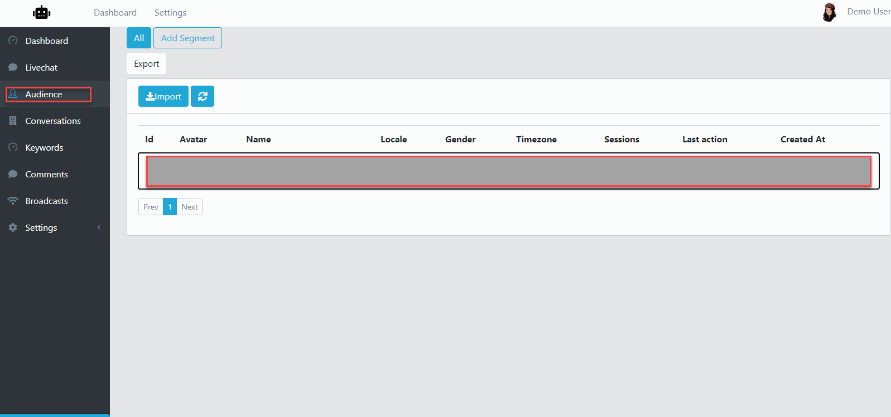
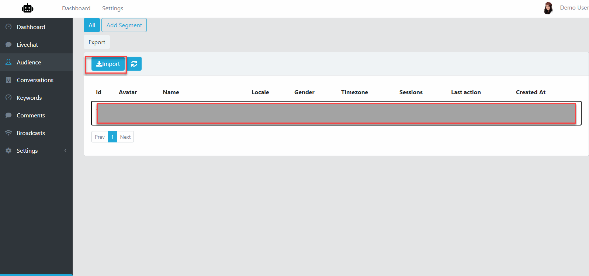
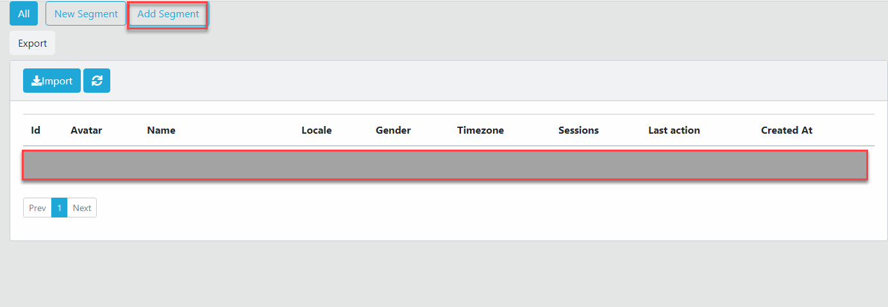
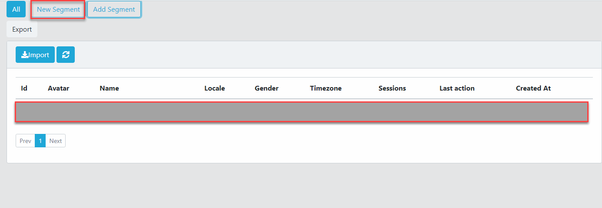
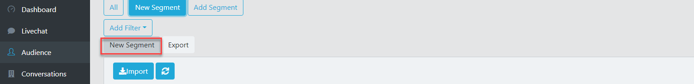

Chatbot Subscribers
==============

==============
Scan Old Subscribers
==============

- In the Bot Dashboard page, select Audience from the left menu.

- Next, click Import.

- In the Import Dialog, if you have large amount of Subscribers, select Scan in Background. If not, select Scan Now.
- For Scan Now, it will take minutes so the scanning completed
- For Scan in Background, it will take some hours to completed.

==============
Segment Subscribers
==============

- Still in the Audience page, click Add Segment.

- Click the created Segment to select.

- Click Add Filter, then choose item from the dropdown.

==============
Rename Segment Subscribers
==============

- Still in the Audience, select a Segment.
- Click to the Segment name.

- Enter new name for this segment then click Check button.

==============
Remove Segment Subscribers
==============

- Still in the Audience, hover the segment.
- There will have a Delete button display, just click this button to delete the Segment
