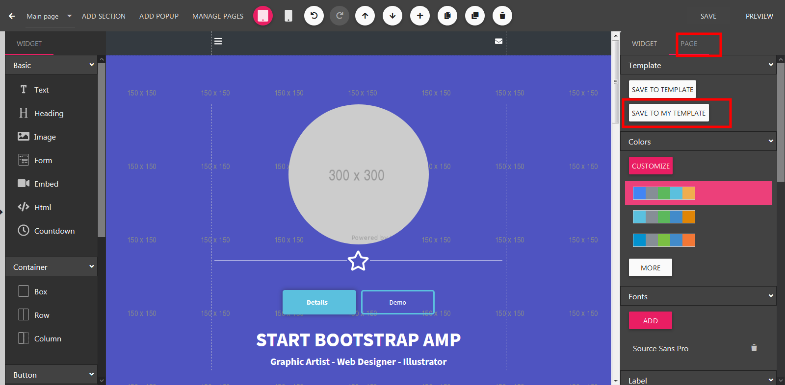

Templates
==============

==============
Create Page Template
==============
- Logging your profile, click Projects.
- Select a project, click Open in Builder.
.. image:: ../assets/images/edit_website.jpg
.. image:: ../assets/images/edit_website2.jpg
- On the right panel, select Page tab.
- Click Save to My Template.

==============
Create Section Template
==============

- Logging your profile, click Projects.
- Select a project, click Open in Builder.
.. image:: ../assets/images/edit_website.jpg
.. image:: ../assets/images/edit_website2.jpg

- Now in the Builder Canvas, Click to Edit a section.
- On the right panel, click Save to My Template.

.. image:: ../assets/images/section_template.png

==============
Create Popup Template
==============

- Logging your profile, click Projects.
- Select a project, click Open in Builder.
.. image:: ../assets/images/edit_website.jpg
.. image:: ../assets/images/edit_website2.jpg

- Now in the builder, click the Page Tabs dropdown located on the header
- Select a popup on the menu dropdown.

.. image:: ../assets/images/editpopup.jpg

- Next, select Popup tab. Then click Save to My Template.

